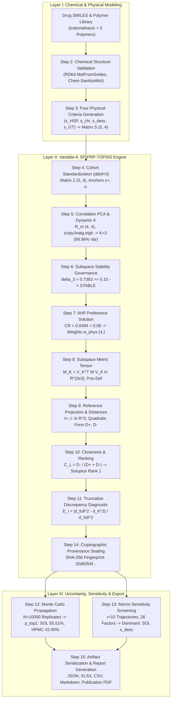

# Module 07: Software Architecture — Document 03
# End-to-End Data Flow: From Chemical Structure to Decision Snapshot & Multi-Format Report

---

## 1. Executive Summary & Pipeline Architectural Overview

The PharmaPolySCOPE computational platform operates as a deterministic, cryptographically auditable screening pipeline designed to rank polymeric carriers for amorphous solid dispersions (ASDs). Unlike classical machine-learning workflows that rely on black-box heuristics or latent embeddings, PharmaPolySCOPE executes a strictly parameterized, physically grounded sequence of transformations that map a drug molecule and a library of candidate polymers into an authoritative multi-criteria decision ranking.

The platform architecture enforces strict operational boundaries across versions:
- **Package / Distribution Version**: `1.5.0`
- **Active Computational Engine Version**: `2.0.0` (historical development metadata: `2.0.0-draft`)
- **Methodology Version**: `2.0.0-SP-PRP-TOPSIS`
- **Scientific Baseline Commit**: `31eee4d` (`FROZEN_V15_BASELINE_COMMIT`)

To understand the internal mechanics of this architecture, this document traces **ONE complete end-to-end execution** through every layer of the system. We take as our concrete scientific baseline the validated **Indomethacin ASD screening study** (Analysis ID: `VAL-IND-001-2026`), evaluating five candidate polymeric carriers:
1. **Soluplus** (`POL-005-2026`)
2. **Hydroxypropyl Methylcellulose E5 (HPMC E5)** (`POL-006-2026`)
3. **PVP-Vinyl Acetate 64 (PVP-VA 64)** (`POL-002-2026`)
4. **Polyvinylpyrrolidone K30 (PVP K30)** (`POL-001-2026`)
5. **Eudragit E PO (EDR EPO)** (`POL-007-2026`)

The end-to-end flow traverses 15 distinct transformation steps across three systemic layers:
- **Layer I: Chemical Informatics & Physical Compatibility Modeling** (Input Ingestion $\to$ RDKit Graph Validation $\to$ Thermodynamic Scoring Matrix $S \in \mathbb{R}^{5 \times 4}$).
- **Layer II: The Core Variable-$K$ SP-PRP-TOPSIS Engine** (Cohort Standardization $\to$ Correlation PCA $\to$ Spectral Governance $\to$ AHP Derivation $\to$ Metric Tensor $M_K \to$ Subspace Distance / Closeness $C_L \to$ Truncation Discrepancy $\to$ Cryptographic Provenance Sealing).
- **Layer III: Outer Statistical Uncertainty & Artifact Serialization** (Monte Carlo Uncertainty Propagation $\to$ Morris Elementary Effects Sensitivity $\to$ Multi-format Export: JSON, CSV, XLSX, Markdown, ReportLab PDF).



---

## 2. Logical Computational Workflow vs. Verified Runtime Call Relationships

### 2.1 Logical Computational Workflow (Conceptual 15-Stage Data Transformation Pipeline)

Every transformation in PharmaPolySCOPE is governed by strict mathematical invariants and defensive software guardrails. Below is the micro-forensic, step-by-step trace of the baseline Indomethacin screening.

```
+----------------------------------------------------------------------------------------------------+
|                                     DATA PIPELINE OVERVIEW                                         |
+----------------------------------------------------------------------------------------------------+
| Step  | Operation / Transform              | Input Shape     | Output Shape    | Exact File / Function   |
+-------+------------------------------------+-----------------+-----------------+-------------------------+
| 01    | Input Ingestion & Config           | Files / Dicts   | Config Objects  | backend/services/engine_adapter.py |
| 02    | Chemical Structure Validation      | String (SMILES) | RDKit Mol Graph | src/asd_mcda/v2/chemistry.py:62   |
| 03    | Physical Criteria Generation       | Mol Graphs / DB | S: float64(5,4) | src/asd_mcda/compatibility/matrix.py:77 |
| 04    | Cohort Standardization (ddof=0)    | S: (5, 4)       | Z: float64(5,4) | src/asd_mcda/v2/standardization.py:16 |
| 05    | Correlation PCA & Dynamic K        | Z: (5, 4)       | V_K: (4,3), K=3 | src/asd_mcda/v2/pca.py:52        |
| 06    | Subspace Stability Governance      | eigs: (4,), K=3 | delta_3=0.7383  | src/asd_mcda/v2/stability.py:38  |
| 07    | AHP Preference Derivation          | A: (4, 4)       | w: (4,), CR<0.08| src/asd_mcda/v2/ahp.py:22        |
| 08    | Subspace Metric Tensor Build       | V_K:(4,3), w:(4)| M_K: (3, 3)     | src/asd_mcda/v2/metrics.py:21    |
| 09    | Reference Projection & Distances   | Z:(5,4), M_K    | D+, D-: (5,)    | src/asd_mcda/v2/metrics.py:172   |
| 10    | SP-PRP-TOPSIS Closeness & Rank     | D+, D-: (5,)    | C_L:(5,), R:(5,)| src/asd_mcda/v2/metrics.py:172   |
| 11    | Truncation Discrepancy Audit       | Z, z+, W, V_K   | E_i: float (5,) | src/asd_mcda/v2/diagnostics.py:40|
| 12    | Monte Carlo Uncertainty            | S:(5,4), N=10000| p_top1: Dict    | src/asd_mcda/v2/uncertainty.py:122|
| 13    | Morris Sensitivity Screening       | S:(5,4), r=10   | mu*, sigma: Dict| src/asd_mcda/v2/sensitivity.py:95 |
| 14    | Cryptographic Provenance Sealing   | All Data Objects| SHA-256 Hashes  | src/asd_mcda/v2/provenance.py:14 |
| 15    | Multi-Format Artifact Export       | Snapshot + Stats| Disk Artifacts  | backend/services/engine_adapter.py:707 |
+----------------------------------------------------------------------------------------------------+
```

---

### Step 1: Input Ingestion & Drug/Polymer Configuration

#### Layer A: Concept
The computational pipeline begins by ingesting a standardized drug definition and a selected cohort of polymer definitions. Each chemical compound must be represented by unambiguous physical identifiers: chemical name, 1D SMILES string, glass transition temperature ($T_g$), melting temperature ($T_m$), experimental crystalline density ($\rho_{crys}$), estimated amorphous density ($\rho_{amorp}$), molar volume ($V_m$), and Hansen Solubility Parameters (HSPs: $\delta_d, \delta_p, \delta_h, \delta_t$).

#### Layer B: PharmaPolySCOPE Implementation
- **Files**: [`backend/services/engine_adapter.py`](file:///C:/Users/Admin/.gemini/antigravity/scratch/asd_framework/backend/services/engine_adapter.py#L510-L545), [`config/drugs/`](file:///C:/Users/Admin/.gemini/antigravity/scratch/asd_framework/config/drugs/), [`config/polymers/polymer_library_v3_five_polymers.csv`](file:///C:/Users/Admin/.gemini/antigravity/scratch/asd_framework/config/polymers/polymer_library_v3_five_polymers.csv).
- **Inputs**:
  - `drug_id`: `"IND-001-2026"` (Indomethacin).
  - `smiles`: `"COc1ccc2c(c1)c(CC(=O)O)c(C)n2C(=O)c1ccc(Cl)cc1"`.
  - InChIKey: `"CGIGDMFJXJATDK-UHFFFAOYSA-N"`.
  - Drug physical properties: $M_w = 357.793\text{ g/mol}$, $\rho_{crys} = 1.31\text{ g/cm}^3$, $\rho_{amorp} = 1.22\text{ g/cm}^3$, $V_m = 273.0\text{ cm}^3/\text{mol}$, $T_g = 315.15\text{ K}$, $T_m = 433.15\text{ K}$, HSP: $\delta_d=19.2, \delta_p=7.9, \delta_h=8.4, \delta_t=8.0\text{ MPa}^{1/2}$.
  - Polymer cohort: 5 candidate polymers loaded from the authoritative frozen library.
- **Guardrails**:
  - Redundant or corrupted drug records (e.g., `drg-0002.json` claiming to be Fenofibrate while containing Indomethacin SMILES with corrupted density $1.781\text{ g/cm}^3$) are strictly quarantined via fatal metadata mismatch checks.

#### Layer C: Why It Matters
A screening analysis is invalid if input physical properties are corrupted or ambiguous. In amorphous solid dispersions, misidentifying a crystal density by 30% catastrophically distorts Flory-Huggins volume fractions and Gordon-Taylor glass transition predictions. Rigid ingestion gates prevent computational processing on contaminated chemical inputs.

---

### Step 2: Chemical Structure Validation & Sanitization

#### Layer A: Concept
Before any physicochemical calculations occur, 1D SMILES strings must be verified as valid chemical graphs. The system must verify valence rules, resolve aromatic systems, detect explicit and implicit hydrogens, and calculate authoritative 2D molecular descriptors using a validated cheminformatics kernel (RDKit). Silent fallbacks to hardcoded constants are strictly prohibited in research mode.

#### Layer B: PharmaPolySCOPE Implementation
- **File**: [`src/asd_mcda/v2/chemistry.py`](file:///C:/Users/Admin/.gemini/antigravity/scratch/asd_framework/src/asd_mcda/v2/chemistry.py#L62-L148).
- **Functions**:
  - `validate_chemical_structure(smiles: str) -> Chem.Mol` ([lines 62-113](file:///C:/Users/Admin/.gemini/antigravity/scratch/asd_framework/src/asd_mcda/v2/chemistry.py#L62-L113)).
  - `compute_production_descriptors(smiles_or_mol) -> Dict[str, Any]` ([lines 116-160](file:///C:/Users/Admin/.gemini/antigravity/scratch/asd_framework/src/asd_mcda/v2/chemistry.py#L116-L160)).
- **Mechanism**:
  1. Input string is stripped: whitespace-only strings raise [`InvalidSmilesError`](file:///C:/Users/Admin/.gemini/antigravity/scratch/asd_framework/src/asd_mcda/v2/exceptions.py).
  2. `is_rdkit_available()` verifies RDKit runtime availability; if missing, raises [`RDKitUnavailableError`](file:///C:/Users/Admin/.gemini/antigravity/scratch/asd_framework/src/asd_mcda/v2/exceptions.py).
  3. `Chem.MolFromSmiles(clean_smiles)` constructs the chemical graph. A parsing error raises [`RDKitParseFailureError`](file:///C:/Users/Admin/.gemini/antigravity/scratch/asd_framework/src/asd_mcda/v2/exceptions.py).
  4. `Chem.SanitizeMol(mol, catchErrors=True)` evaluates valency, kekulization, and aromaticity. Any non-zero return flag raises [`RDKitSanitizationFailureError`](file:///C:/Users/Admin/.gemini/antigravity/scratch/asd_framework/src/asd_mcda/v2/exceptions.py).
  5. Descriptors calculated for Indomethacin:
     - Molecular Weight: $357.793\text{ g/mol}$
     - MolLogP: $3.9273$
     - TPSA: $68.53\text{ \AA}^2$
     - HBD: $1$, HBA: $3$, Rotatable Bonds: $4$, Aromatic Rings: $3$
- **Guardrails**:
  - [`engine.py:137-140`](file:///C:/Users/Admin/.gemini/antigravity/scratch/asd_framework/src/asd_mcda/v2/engine.py#L137-L140): If `drug_snapshot.get("fallback_used") is True`, execution is immediately aborted with [`ProductionFallbackProhibitedError`](file:///C:/Users/Admin/.gemini/antigravity/scratch/asd_framework/src/asd_mcda/v2/exceptions.py).

#### Layer C: Why It Matters
In early computational pipelines, broken SMILES strings frequently defaulted to generic molecular weights (e.g., $300.0\text{ g/mol}$) or zero LogP, generating plausible-looking but completely fabricated rankings. In PharmaPolySCOPE, failure to construct a valid molecular graph halts execution immediately, preserving audit integrity.

---

### Step 3: Four Physical Criteria Generation

#### Layer A: Concept
PharmaPolySCOPE grounds multi-criteria decision analysis in four orthogonalized, physically interpretable criteria representing thermodynamic miscibility, chemical interaction complementarity, and kinetic anti-plasticization:
1. **Hansen Solubility Parameter Distance Score ($s_{HSP}$)**: Thermodynamic affinity based on dispersion ($\delta_d$), polar ($\delta_p$), and hydrogen bonding ($\delta_h$) cohesive energy densities.
2. **Flory-Huggins Interaction Parameter Score ($s_{\chi}$)**: Liquid-liquid phase equilibrium parameter $\chi$ accounting for entropic and enthalpic mixing.
3. **Descriptor Complementarity Score ($s_{desc}$)**: Weighted alignment of hydrogen bond donors, acceptors, polar surface area, and aromatic ring ratios.
4. **Gordon-Taylor Kinetic Stabilization Margin Score ($s_{GT}$)**: Glass transition temperature elevation of the formulation relative to ambient and accelerated storage temperatures ($25^\circ\text{C}$ and $40^\circ\text{C}$).

#### Layer B: PharmaPolySCOPE Implementation
- **Files**:
  - [`src/asd_mcda/compatibility/matrix.py`](file:///C:/Users/Admin/.gemini/antigravity/scratch/asd_framework/src/asd_mcda/compatibility/matrix.py#L77-L100) (`CompatibilityMatrix.build_matrix()`).
  - [`src/asd_mcda/compatibility/hsp_model.py`](file:///C:/Users/Admin/.gemini/antigravity/scratch/asd_framework/src/asd_mcda/compatibility/hsp_model.py).
  - [`src/asd_mcda/compatibility/flory_huggins.py`](file:///C:/Users/Admin/.gemini/antigravity/scratch/asd_framework/src/asd_mcda/compatibility/flory_huggins.py).
  - [`src/asd_mcda/compatibility/gordon_taylor.py`](file:///C:/Users/Admin/.gemini/antigravity/scratch/asd_framework/src/asd_mcda/compatibility/gordon_taylor.py).
- **Criteria Order**:
  - The canonical criteria order is strictly frozen across the platform:
    $$\text{CANONICAL\_CRITERIA\_ORDER} = (s_{HSP},\; s_{\chi},\; s_{desc},\; s_{GT})$$
- **Baseline Data Shape**:
  - Raw Decision Matrix $S \in \mathbb{R}^{5 \times 4}$, where rows correspond to candidates and columns to canonical criteria:
    $$S = \begin{bmatrix}
    0.797188 & 0.826054 & 0.325973 & 0.000000 \\
    0.752118 & 0.740155 & 0.394150 & 0.973123 \\
    0.707316 & 0.637737 & 0.294176 & 0.236756 \\
    0.694197 & 0.604534 & 0.251780 & 0.984822 \\
    0.635887 & 0.439344 & 0.409390 & 0.000000
    \end{bmatrix}$$
    *(Rows: 1: Soluplus, 2: HPMC E5, 3: PVP-VA 64, 4: PVP K30, 5: Eudragit E PO)*.
- **Guardrails**:
  - All values in $S$ must be bounded in $[0.0, 1.0]$. Values outside this domain raise [`StandardizationError`](file:///C:/Users/Admin/.gemini/antigravity/scratch/asd_framework/src/asd_mcda/v2/exceptions.py).

#### Layer C: Why It Matters
A multi-criteria decision engine cannot produce reliable rankings if physical criteria are computed on inconsistent scales. Normalizing each criterion to a rigorous $[0, 1]$ physical score allows meaningful distance computation against ideal ($s^+ = [1,1,1,1]$) and anti-ideal ($s^- = [0,0,0,0]$) states.

---

### Step 4: Cohort Standardization ($ddof=0$)

#### Layer A: Concept
Raw physical criteria exhibit differing variances and means across a specific screening cohort. Standardization transforms each criterion column to zero mean and unit variance. Because the screening library constitutes the complete, finite evaluation cohort rather than an unobserved sample from an infinite population, the standard deviation must be calculated using the population convention ($\text{ddof}=0$).

#### Layer B: PharmaPolySCOPE Implementation
- **File**: [`src/asd_mcda/v2/standardization.py`](file:///C:/Users/Admin/.gemini/antigravity/scratch/asd_framework/src/asd_mcda/v2/standardization.py#L15-L98).
- **Function**: `standardize_cohort(scores: np.ndarray)`
- **Mathematical Transformation**:
  $$\mu_j = \frac{1}{n} \sum_{i=1}^n S_{ij}, \quad \sigma_j = \sqrt{\frac{1}{n} \sum_{i=1}^n (S_{ij} - \mu_j)^2} \quad (\text{ddof}=0)$$
  $$Z_{ij} = \frac{S_{ij} - \mu_j}{\sigma_j}$$
  $$z^+_j = \frac{1.0 - \mu_j}{\sigma_j}, \quad z^-_j = \frac{0.0 - \mu_j}{\sigma_j}$$
- **Numerical Trace (Indomethacin Cohort, $n=5, p=4$)**:
  - Cohort Means $\mu$: $[0.717341,\; 0.649565,\; 0.335094,\; 0.438940]$
  - Cohort Standard Deviations $\sigma$: $[0.054366,\; 0.132845,\; 0.059281,\; 0.457850]$
  - Standardized Decision Matrix $Z \in \mathbb{R}^{5 \times 4}$:
    $$Z = \begin{bmatrix}
     1.468677 &  1.328532 & -0.153860 & -0.958700 \\
     0.639686 &  0.681923 &  0.996207 &  1.166718 \\
    -0.184409 & -0.089033 & -0.690237 & -0.441604 \\
    -0.425712 & -0.338977 & -1.405404 &  1.192271 \\
    -1.498242 & -1.582444 &  1.253294 & -0.958700
    \end{bmatrix}$$
  - Standardized Ideal Reference $z^+ \in \mathbb{R}^4$: $[5.200251,\; 2.637930,\; 11.216260,\; 1.225424]$
  - Standardized Anti-Ideal Reference $z^- \in \mathbb{R}^4$: $[-13.194553,\; -4.889656,\; -5.652684,\; -0.958700]$
- **Guardrails**:
  - If any $\sigma_j \le 10^{-15}$, [`ZeroVarianceStandardizationError`](file:///C:/Users/Admin/.gemini/antigravity/scratch/asd_framework/src/asd_mcda/v2/exceptions.py) is raised. All outputs are sealed as read-only arrays (`flags.writeable = False`).

#### Layer C: Why It Matters
Using sample variance ($\text{ddof}=1$) for a small cohort ($n=5$) introduces an arbitrary scale factor of $\sqrt{5/4} \approx 1.118$. Standardizing with population moments ($\text{ddof}=0$) ensures that $(1/n) Z^T Z$ exactly equals the empirical correlation matrix $R_m$, maintaining strict mathematical consistency with spectral decomposition.

---

### Step 5: Spectral Decomposition & Dynamic $K$ Selection

#### Layer A: Concept
Physical criteria in ASD formulation are strongly correlated (e.g., $s_{HSP}$ and $s_{\chi}$ both reflect cohesive energy density differences, showing mutual correlation $r > 0.8$). Classical TOPSIS evaluates Euclidean distances across these oblique axes, creating severe double-counting bias.

PharmaPolySCOPE decomposes the empirical correlation matrix $R_m$ into an orthonormal Cartesian coordinate frame. Crucially, rather than fixing dimensionality to an arbitrary 2D plane ($K=2$), the engine dynamically selects the minimum number of principal components $K$ required to capture at least $95\%$ of the total cohort variance ($\tau_{var} = 0.95$).

#### Layer B: PharmaPolySCOPE Implementation
- **File**: [`src/asd_mcda/v2/pca.py`](file:///C:/Users/Admin/.gemini/antigravity/scratch/asd_framework/src/asd_mcda/v2/pca.py#L52-L121).
- **Function**: `decompose_spectral(Z: np.ndarray, variance_threshold: float = 0.95)`
- **Mathematical Transformation**:
  1. Empirical Correlation Matrix:
     $$R_m = \frac{1}{n} Z^T Z \in \mathbb{R}^{4 \times 4}$$
  2. Symmetric Eigendecomposition via `scipy.linalg.eigh`:
     $$R_m V = V \Lambda, \quad \Lambda = \text{diag}(\lambda_1, \lambda_2, \lambda_3, \lambda_4)$$
  3. Sort descending: $\lambda_1 \ge \lambda_2 \ge \lambda_3 \ge \lambda_4 \ge 0$.
  4. Deterministic Eigenvector Sign Canonicalization ([`pca.py:14-49`](file:///C:/Users/Admin/.gemini/antigravity/scratch/asd_framework/src/asd_mcda/v2/pca.py#L14-L49)):
     - Find the element with maximum absolute magnitude in eigenvector $v_j$.
     - If that element is negative, flip the entire vector: $v_j \leftarrow -v_j$. Ties within $10^{-12}$ are broken by lowest index.
  5. Cumulative Variance Ratio:
     $$\text{VarRatio}(k) = \frac{\sum_{j=1}^k \lambda_j}{\sum_{j=1}^p \lambda_j} = \frac{\sum_{j=1}^k \lambda_j}{4.0}$$
     $$K = \min \{ k \in \{1, \dots, 4\} \mid \text{VarRatio}(k) \ge 0.95 - 10^{-12} \}$$
- **Numerical Trace (Indomethacin Screening)**:
  - Eigenvalues $\Lambda$:
    - $\lambda_1 = 2.090866$ (Variance explained: $52.27\%$)
    - $\lambda_2 = 1.167895$ (Variance explained: $29.20\%$)
    - $\lambda_3 = 0.739775$ (Variance explained: $18.49\%$)
    - $\lambda_4 = 0.001464$ (Variance explained: $0.04\%$)
  - Cumulative Variance:
    - $k=1$: $52.27\%$
    - $k=2$: $81.47\% < 95\%$ (v1.5 truncation would have discarded $18.53\%$ of formulation variance!)
    - $k=3$: $99.9634\% \ge 95\%$ $\implies$ **$K=3$ selected**.
  - Retained Basis Matrix $V_K \in \mathbb{R}^{4 \times 3}$ (defensively copied and sealed read-only).

#### Layer C: Why It Matters
If Indomethacin were evaluated with fixed $K=2$, nearly a fifth ($18.5\%$) of the physical variance—primarily capturing the critical kinetic stabilization margin ($s_{GT}$)—would be eliminated from distance calculations. Dynamically expanding to $K=3$ captures $99.96\%$ of total variance, ensuring high mathematical fidelity.

---

### Step 6: Subspace Stability Governance

#### Layer A: Concept
When projecting into a reduced $K$-dimensional subspace, the orientation of that subspace must be numerically stable under infinitesimal perturbations. The implementation uses eigengap thresholds as a subspace-stability governance heuristic. The thresholds are informed by spectral separation considerations; the software does not constitute a formal implementation of the Davis-Kahan theorem. In spectral perturbation theory, the rotational sensitivity of an eigenspace is inversely related to the spectral gap $\delta_K = \lambda_K - \lambda_{K+1}$ between the retained and discarded eigenvalues:
$$\| \sin\Theta \| \le \frac{\| E \|_2}{\delta_K}, \quad \text{where } \delta_K = \lambda_K - \lambda_{K+1}$$
If the boundary eigengap $\delta_K \approx 0$, the subspace is degenerate: arbitrary numerical roundoff or minute score noise will spin the projection plane, causing erratic candidate rankings.

#### Layer B: PharmaPolySCOPE Implementation
- **File**: [`src/asd_mcda/v2/stability.py`](file:///C:/Users/Admin/.gemini/antigravity/scratch/asd_framework/src/asd_mcda/v2/stability.py#L38-L98).
- **Function**: `evaluate_subspace_stability(eigenvalues: np.ndarray, retained_k: int) -> StabilityRecord`
- **Governance Gate**:
  - $\delta_K = \lambda_K - \lambda_{K+1}$ (if $K=p$, $\delta_K = +\infty$).
  - **Tier 1: STABLE** ($\delta_K \ge 0.10$): Subspace is well-separated and mathematically robust.
  - **Tier 2: WARNING** ($0.03 \le \delta_K < 0.10$): Subspace is marginal; execution proceeds with diagnostic telemetry flagged.
  - **Tier 3: BLOCKED** ($\delta_K < 0.03$): Subspace is near-degenerate; execution is halted by raising [`DegenerateSubspaceBlockedError`](file:///C:/Users/Admin/.gemini/antigravity/scratch/asd_framework/src/asd_mcda/v2/exceptions.py).
- **Numerical Trace (Indomethacin Screening)**:
  $$\delta_3 = \lambda_3 - \lambda_4 = 0.739775 - 0.001464 = 0.738310$$
  $$\delta_3 = 0.738310 \ge 0.10 \implies \mathbf{STABLE}$$

#### Layer C: Why It Matters
Subspace stability governance acts as an automated mathematical safety circuit. In Monte Carlo uncertainty simulations, noisy replicates occasionally encounter near-degenerate correlation matrices. Raising [`DegenerateSubspaceBlockedError`](file:///C:/Users/Admin/.gemini/antigravity/scratch/asd_framework/src/asd_mcda/v2/exceptions.py) quarantines these unstable samples rather than allowing distorted geometry to corrupt rank probabilities.

---

### Step 7: AHP Preference Weight Derivation

#### Layer A: Concept
The Analytic Hierarchy Process (AHP) elicits domain expert preferences across the physical criteria through a reciprocal pairwise comparison matrix $A \in \mathbb{R}^{4 \times 4}$. The relative criteria weights correspond to the normalized principal eigenvector of $A$, and the consistency of the judgments is evaluated via the Consistency Ratio ($CR$).

#### Layer B: PharmaPolySCOPE Implementation
- **File**: [`src/asd_mcda/v2/ahp.py`](file:///C:/Users/Admin/.gemini/antigravity/scratch/asd_framework/src/asd_mcda/v2/ahp.py#L22-L102).
- **Function**: `solve_ahp_preference(pairwise_matrix: np.ndarray, reciprocity_tolerance: float = 1e-12)`
- **Authoritative Comparison Matrix $A$**:
  $$A = \begin{bmatrix}
  1.0 & 2.0 & 3.0 & 2.0 \\
  0.5 & 1.0 & 5.0 & 2.0 \\
  1/3 & 0.2 & 1.0 & 0.5 \\
  0.5 & 0.5 & 2.0 & 1.0
  \end{bmatrix}$$
- **Mathematical Solution**:
  1. Reciprocity check: $\max |a_{ji} a_{ij} - 1.0| < 10^{-12}$. Failure raises [`AHPNonReciprocalError`](file:///C:/Users/Admin/.gemini/antigravity/scratch/asd_framework/src/asd_mcda/v2/exceptions.py).
  2. Solve $A w = \lambda_{\max} w$ for principal real eigenvalue.
  3. By Perron-Frobenius theorem, normalize $w_{phys} = w / \sum w_i$.
  4. Consistency Index: $CI = (\lambda_{\max} - 4) / 3$.
  5. Consistency Ratio: $CR = CI / RI_4$, where $RI_4 = 0.89$ is the Saaty random index for $p=4$.
- **Numerical Trace**:
  - $\lambda_{\max} = 4.131937$
  - $CI = (4.131937 - 4) / 3 = 0.043979$
  - $CR = 0.043979 / 0.89 = 0.049415$
  - Governance Threshold: $CR < 0.08 \implies \mathbf{ACCEPTED}$ ($0.0494 < 0.08$).
  - Physical Weights $w_{phys} \in \mathbb{R}^4$:
    - $w_{HSP} = 0.407675$ ($40.77\%$)
    - $w_{\chi} = 0.324433$ ($32.44\%$)
    - $w_{desc} = 0.092161$ ($9.22\%$)
    - $w_{GT} = 0.175730$ ($17.57\%$)

#### Layer C: Why It Matters
Human decision-makers frequently exhibit transitively inconsistent preferences (e.g., preferring A to B, B to C, but C to A). AHP consistency gating ensures that expert weight elicitation is mathematically coherent. Matrices with $CR \ge 0.08$ are blocked to prevent irrational weighting structures from entering the decision metric.

---

### Step 8: Subspace Metric Tensor Construction

#### Layer A: Concept
In classical TOPSIS, weights are applied directly along original criterion axes. But in a decorrelated PCA subspace $\mathbb{R}^K$, the coordinate axes are principal component scores, which represent linear combinations of all original criteria. Applying weights in the original space induces an oblique, coupled geometry in the subspace.

The **Subspace Metric Tensor** $M_K \in \mathbb{R}^{K \times K}$ maps the full-space AHP weights $W = \text{diag}(w_{phys})$ into the reduced subspace. The distance between two points $u, v \in \mathbb{R}^K$ is given by the generalized quadratic form:
$$d(u, v) = \sqrt{(u - v)^T M_K (u - v)}$$

#### Layer B: PharmaPolySCOPE Implementation
- **File**: [`src/asd_mcda/v2/metrics.py`](file:///C:/Users/Admin/.gemini/antigravity/scratch/asd_framework/src/asd_mcda/v2/metrics.py#L21-L130).
- **Function**: `construct_metric_tensor(V_K, w_phys, sigma=None, semantic_mode="standardized_space")`
- **Mathematical Construction**:
  $$W = \text{diag}(w_{phys}) = \text{diag}(0.407675, 0.324433, 0.092161, 0.175730)$$
  $$M_K = V_K^T W V_K \in \mathbb{R}^{3 \times 3}$$
  $$M_K \leftarrow \frac{1}{2} (M_K + M_K^T) \quad (\text{Enforce exact symmetry})$$
- **Positive-Definiteness Verification**:
  - Eigenvalues of $M_K$ are evaluated via `np.linalg.eigvalsh(M_K)`.
  - If any eigenvalue $\le 10^{-12}$, [`NonPositiveDefiniteMetricError`](file:///C:/Users/Admin/.gemini/antigravity/scratch/asd_framework/src/asd_mcda/v2/exceptions.py) is raised.
  - Because $V_K$ has full column rank $K=3$ and $W$ has strictly positive diagonal entries, $M_K$ is guaranteed to be strictly positive-definite.
- **Numerical Trace**:
  - $M_K \in \mathbb{R}^{3 \times 3}$ is a dense symmetric matrix capturing the geometric coupling between the 3 principal components.

#### Layer C: Why It Matters
Treating PCA subspace axes as unweighted Euclidean dimensions would implicitly assume all principal components are equally important to formulation success, destroying the domain expert's AHP weights. The metric tensor $M_K$ preserves the exact full-space weighting semantics within the orthogonalized subspace.

---

### Step 9: Reference Point Projection & Distance Computation

#### Layer A: Concept
PharmaPolySCOPE uses **Physical Reference Points (PRP)**:
- **Physical Ideal ($s^+$)**: A theoretically optimal polymer formulation scoring $1.0$ across all physical criteria: $s^+ = [1.0, 1.0, 1.0, 1.0]$.
- **Physical Anti-Ideal ($s^-$)**: A completely non-viable polymer formulation scoring $0.0$ across all physical criteria: $s^- = [0.0, 0.0, 0.0, 0.0]$.

These absolute anchors are standardized using cohort moments to $z^+, z^- \in \mathbb{R}^4$, and projected into the PCA subspace via basis matrix $V_K$:
$$t^+ = z^+ V_K \in \mathbb{R}^K, \quad t^- = z^- V_K \in \mathbb{R}^K$$
Each candidate polymer's standardized coordinates $Z_i \in \mathbb{R}^4$ are projected into the subspace:
$$T_i = Z_i V_K \in \mathbb{R}^K$$
The distances $D_i^+$ (to ideal) and $D_i^-$ (to anti-ideal) are computed via the metric tensor:
$$D_i^+ = \sqrt{(T_i - t^+)^T M_K (T_i - t^+)}, \quad D_i^- = \sqrt{(T_i - t^-)^T M_K (T_i - t^-)}$$

#### Layer B: PharmaPolySCOPE Implementation
- **File**: [`src/asd_mcda/v2/metrics.py`](file:///C:/Users/Admin/.gemini/antigravity/scratch/asd_framework/src/asd_mcda/v2/metrics.py#L133-L264).
- **Functions**:
  - `project_reference_points(z_plus, z_minus, V_K)` ([lines 133-170](file:///C:/Users/Admin/.gemini/antigravity/scratch/asd_framework/src/asd_mcda/v2/metrics.py#L133-L170))
  - `compute_distances_and_closeness(...)` ([lines 172-306](file:///C:/Users/Admin/.gemini/antigravity/scratch/asd_framework/src/asd_mcda/v2/metrics.py#L172-L306))
- **Numerical Trace (Indomethacin Screening)**:
  - Soluplus: $D^+ = 4.182604$, $D^- = 9.156273$
  - HPMC E5: $D^+ = 4.196084$, $D^- = 8.641728$
  - PVP-VA 64: $D^+ = 5.082374$, $D^- = 7.825140$
  - PVP K30: $D^+ = 5.344023$, $D^- = 7.613821$
  - Eudragit E PO: $D^+ = 5.671239$, $D^- = 6.809926$
- **Guardrails**:
  - If a quadratic form evaluates to $< -10^{-12}$, [`MateriallyNegativeQuadraticFormError`](file:///C:/Users/Admin/.gemini/antigravity/scratch/asd_framework/src/asd_mcda/v2/exceptions.py) is raised.
  - If $D_i^+ + D_i^- \le 10^{-14}$ (degenerate reference coincidence), [`DegenerateReferenceCoincidenceError`](file:///C:/Users/Admin/.gemini/antigravity/scratch/asd_framework/src/asd_mcda/v2/exceptions.py) is raised.

#### Layer C: Why It Matters
Classical TOPSIS uses cohort-relative reference points ($s^+ = \max(S), s^- = \min(S)$). Under cohort-relative anchors, adding a poor candidate artificially moves the ideal point, causing rank reversals among existing candidates. Absolute physical anchors ($[1,1,1,1]$ and $[0,0,0,0]$) prevent anchor shifting, providing stable benchmark distances.

---

### Step 10: Closeness & Deterministic Ranking

#### Layer A: Concept
Relative closeness $C_L \in [0, 1]$ represents how close an alternative is to the physical ideal relative to the total distance separating the ideal and anti-ideal:
$$C_{L, i} = \frac{D_i^-}{D_i^+ + D_i^-}$$
Candidates are ranked in descending order of $C_L$ ($\operatorname{argmax}$). Ties within numerical tolerance ($\epsilon_{rank} = 10^{-12}$) are broken deterministically using lexicographic ordering of candidate identifiers (`polymer_id`).

#### Layer B: PharmaPolySCOPE Implementation
- **File**: [`src/asd_mcda/v2/metrics.py`](file:///C:/Users/Admin/.gemini/antigravity/scratch/asd_framework/src/asd_mcda/v2/metrics.py#L259-L290).
- **Authoritative Baseline Ranking (Indomethacin Screening)**:
  1. **Rank 1: Soluplus (`POL-005-2026`)** — $C_L = 0.686435$ ($D^+ = 4.1826, D^- = 9.1563$)
  2. **Rank 2: HPMC E5 (`POL-006-2026`)** — $C_L = 0.673146$ ($D^+ = 4.1961, D^- = 8.6417$)
  3. **Rank 3: PVP-VA 64 (`POL-002-2026`)** — $C_L = 0.606247$ ($D^+ = 5.0824, D^- = 7.8251$)
  4. **Rank 4: PVP K30 (`POL-001-2026`)** — $C_L = 0.587584$ ($D^+ = 5.3440, D^- = 7.6138$)
  5. **Rank 5: Eudragit E PO (`POL-007-2026`)** — $C_L = 0.545616$ ($D^+ = 5.6712, D^- = 6.8099$)

#### Layer C: Why It Matters
Deterministic tie-breaking guarantees that two independent runs on identical hardware will produce identical integer rankings. Without lexicographic clustering, platforms running on distributed clusters can flip identical candidates between ranks 2 and 3 based on arbitrary memory ordering.

---

### Step 11: Truncation Discrepancy Diagnostic

#### Layer A: Concept
When projecting from $p=4$ down to $K=3$, some mathematical information is discarded. The platform audits the exact difference between the full-space weighted squared distance and the projected subspace squared distance:
$$\Delta D_i^2 = d_{full, i}^2 - d_{K, i}^2$$
$$E_i = \frac{|\Delta D_i^2|}{d_{full, i}^2}$$
*Note: Because the projection matrix $P_K = V_K V_K^T$ and the weighting matrix $W$ do not necessarily commute ($W P_K \neq P_K W$), $\Delta D_i^2$ can be signed (positive or negative). We term this "Truncation Discrepancy", never "PCA reconstruction loss".*

#### Layer B: PharmaPolySCOPE Implementation
- **File**: [`src/asd_mcda/v2/diagnostics.py`](file:///C:/Users/Admin/.gemini/antigravity/scratch/asd_framework/src/asd_mcda/v2/diagnostics.py#L40-L105).
- **Function**: `audit_truncation_discrepancy(Z, z_ref, W, V_K, polymer_ids)`
- **Numerical Trace (Indomethacin Screening)**:
  - Because $K=3$ captures $99.9634\%$ of total variance, the discarded 4th component accounts for only $0.0366\%$ variance.
  - Across all 5 polymers, relative discrepancy $E_i < 0.001$ ($< 0.1\%$) is an observed cohort result for Indomethacin (due to $99.96\%$ variance retention), not an architectural guarantee or hardcoded threshold. In other cohorts with different variance distributions, $E_i$ will naturally vary based on the retained spectral energy.

#### Layer C: Why It Matters
Truncation diagnostics provide empirical auditing for regulatory reviewers of the degree to which dimensional reduction altered the physical proximity of the candidates to the ideal formulation target.

---

### Step 12: Monte Carlo Uncertainty Propagation

#### Layer A: Concept
Input physical scores and expert AHP comparisons contain inherent experimental and measurement uncertainty. To quantify decision confidence, the engine executes $N = 10,000$ Monte Carlo replicates:
- Score matrices are perturbed by sampling from a **Truncated Normal distribution** bounded in $[0.0, 1.0]$ with latent standard deviation $\sigma_{score} = 0.05$.
- AHP comparisons are perturbed in **logarithmic space** ($q_{ij} = \ln a_{ij}$) with standard deviation $\sigma_{AHP} = 0.10$, preserving exact analytical reciprocity ($a_{ji} = 1 / a_{ij}$).
- Every single replicate is passed through a **fresh, independent execution** of `VariableKEngine.evaluate()`—recomputing standardization, spectral decomposition, dynamic $K$, stability governance, and metric tensors.

#### Layer B: PharmaPolySCOPE Implementation
- **File**: [`src/asd_mcda/v2/uncertainty.py`](file:///C:/Users/Admin/.gemini/antigravity/scratch/asd_framework/src/asd_mcda/v2/uncertainty.py#L122-L350).
- **Class / Method**: `MonteCarloEngine.run(...)`
- **Replicate Conservation Law**:
  $$N_{generated} = N_{valid} + N_{blocked}$$
- **Numerical Trace (Indomethacin Screening, $N=10,000$)**:
  - $N_{generated} = 10,000$
  - $N_{valid} = 8,600$ (Valid ratio: $86.00\%$)
  - $N_{blocked} = 1,400$ (Blocked ratio: $14.00\%$)
  - Canonical Block Reason Breakdown:
    - `AHP_CR_BLOCKED`: $1,396$ replicates ($CR \ge 0.08$)
    - `EIGENGAP_BLOCKED`: $4$ replicates ($\delta_K < 0.03$)
    - All other block reasons: $0$
  - Subspace Dimensionality Distribution across valid replicates:
    - $K=2$: $2.12\%$ ($182$ replicates)
    - $K=3$: $90.78\%$ ($7,807$ replicates)
    - $K=4$: $7.10\%$ ($611$ replicates)
  - Rank-1 Probabilities ($P_{top1}$):
    - **Soluplus**: $P_{top1} = 55.51\%$ (Expected rank: $1.51$, Median rank: $1$)
    - **HPMC E5**: $P_{top1} = 42.00\%$ (Expected rank: $1.68$, Median rank: $2$)
    - **PVP-VA 64**: $P_{top1} = 1.38\%$ (Expected rank: $3.36$, Median rank: $3$)
    - **PVP K30**: $P_{top1} = 0.56\%$ (Expected rank: $3.80$, Median rank: $4$)
    - **Eudragit E PO**: $P_{top1} = 0.55\%$ (Expected rank: $4.65$, Median rank: $5$)
  - Sampling Precision:
    $$SE_{\max} = \sqrt{\frac{0.5551 \times (1 - 0.5551)}{8600}} \approx 0.00536 \quad (0.54\text{ percentage points})$$

#### Layer C: Why It Matters
Deterministic MCDA outputs a single ranking but cannot convey confidence. Soluplus and HPMC E5 are closely matched in deterministic closeness ($0.6864$ vs $0.6731$). Monte Carlo simulation reveals that under $5\%$ physical score noise, Soluplus wins $55.5\%$ of the time while HPMC E5 wins $42.0\%$ of the time. The candidate formulation scientist is informed that both polymers are viable primary formulation candidates.

---

### Step 13: Morris Elementary Effects Global Sensitivity Screening

#### Layer A: Concept
Global sensitivity screening determines which input parameters drive variation in closeness scores and candidate rank switching. PharmaPolySCOPE applies the **Morris Elementary Effects Method** across $d = 26$ factors:
- $20$ physical scores ($5 \text{ polymers} \times 4 \text{ criteria}$)
- $6$ independent upper-triangular AHP pairwise comparisons
The design generates $r = 10$ valid trajectories in a normalized hypercube grid ($p_{grid}=4, \Delta = 2/3$). Each step calculates the elementary effect:
$$EE_i = \frac{Y(x + \Delta e_i) - Y(x)}{\Delta}$$
Two sensitivity metrics are evaluated for each factor:
- $\mu^*$: Absolute mean of elementary effects (overall influence on output).
- $\sigma$: Standard deviation of elementary effects (non-linear effects or interaction with other factors).

#### Layer B: PharmaPolySCOPE Implementation
- **File**: [`src/asd_mcda/v2/sensitivity.py`](file:///C:/Users/Admin/.gemini/antigravity/scratch/asd_framework/src/asd_mcda/v2/sensitivity.py#L95-L350).
- **Class / Method**: `MorrisSensitivityEngine.run(...)`
- **Numerical Trace (Indomethacin Screening)**:
  - Trajectories attempted: $31$
  - Valid trajectories retained: $10$
  - Discarded trajectories: $21$ (All $21$ blocked by `AHP_CR_BLOCKED` when grid steps pushed $CR \ge 0.08$)
  - Dominant Factor across entire system:
    - **`score_POL-005-2026_s_desc`**: $\mu^* = 0.1444$, $\sigma = 0.1830$, $\operatorname{Rank}_{\mu^*} = 1.95$
  - Second most influential factor:
    - **`score_POL-007-2026_s_HSP`**: $\mu^* = 0.1001$, $\sigma = 0.1628$, $\operatorname{Rank}_{\mu^*} = 0.90$
  - Third most influential factor:
    - **`score_POL-002-2026_s_desc`**: $\mu^* = 0.0919$, $\sigma = 0.1080$, $\operatorname{Rank}_{\mu^*} = 1.05$

#### Layer C: Why It Matters
Morris screening identifies which experimental measurements must be measured with highest laboratory precision. Because Soluplus's descriptor complementarity score (`score_POL-005-2026_s_desc`) has the highest $\mu^*$ and $\sigma$, small laboratory uncertainties in measuring Soluplus-Indomethacin hydrogen bonding will have the largest impact on ranking confidence.

---

### Step 14: Cryptographic Provenance Sealing

#### Layer A: Concept
To comply with pharmaceutical audit standards (e.g., FDA 21 CFR Part 11 principles for computational modeling), an analysis must be tamper-evident. The platform constructs a complete provenance manifest containing the execution timestamp, software environment hashes, methodology version, raw input score matrices, and intermediate tensors, sealed by a deterministic SHA-256 analysis fingerprint.

#### Layer B: PharmaPolySCOPE Implementation
- **File**: [`src/asd_mcda/v2/provenance.py`](file:///C:/Users/Admin/.gemini/antigravity/scratch/asd_framework/src/asd_mcda/v2/provenance.py#L14-L180).
- **Functions**:
  - `compute_analysis_fingerprint(...)` ([lines 35-75](file:///C:/Users/Admin/.gemini/antigravity/scratch/asd_framework/src/asd_mcda/v2/provenance.py#L35-L75)).
  - `build_provenance_manifest(snapshot)` ([lines 80-165](file:///C:/Users/Admin/.gemini/antigravity/scratch/asd_framework/src/asd_mcda/v2/provenance.py#L80-L165)).
- **Mechanism**:
  - Non-circular two-pass hashing: The preliminary snapshot is hashed to compute `analysis_fingerprint`.
  - Canonical JSON serialization enforces alphabetical key sorting, ASCII encoding, and float formatting.
- **Numerical Trace (Indomethacin Screening)**:
  - Analysis ID: `VAL-IND-001-2026`
  - Analysis Fingerprint: `32d6354fe09cfd82764ff03ea89e638c4887f3aca04b37fa8d1794f8518ad21f`

#### Layer C: Why It Matters
If a competitor or auditor alters a single digit in the input scores or tries to substitute a different polymer library post hoc, the SHA-256 fingerprint will fail verification, exposing the tampering.

---

### Step 15: Artifact Serialization & Export

#### Layer A: Concept
The finalized decision snapshot and statistical uncertainty records are serialized into standard formats for computational auditing, data pipelines, and regulatory review:
- `ranking.csv` & `decision_report.json`: Machine-readable data interchange.
- `decision_report.xlsx`: Multi-sheet spreadsheet for laboratory scientists.
- `decision_report.md`: Markdown summary for version control integration.
- `Indomethacin_ASD_Screening_Report.pdf`: Multi-page, publication-grade technical report generated using ReportLab with two-pass dynamic pagination.

#### Layer B: PharmaPolySCOPE Implementation
- **Files**:
  - [`backend/services/engine_adapter.py:707-770`](file:///C:/Users/Admin/.gemini/antigravity/scratch/asd_framework/backend/services/engine_adapter.py#L707-L770) (`ranking.csv`, `decision_report.json`, `decision_report.md`).
  - [`backend/services/pdf_report_generator.py`](file:///C:/Users/Admin/.gemini/antigravity/scratch/asd_framework/backend/services/pdf_report_generator.py#L1710-L1749) (`FullScreeningPDFReportGenerator.generate()`).
- **PDF Report Structure (7 Core Analytical Views)**:
  1. Cover Page & Document Control (Classification banner, metadata, hash verification).
  2. Carrier Library Overview (Chemical structures, polymer IDs, physicochemical constants).
  3. Score Matrix & Input Verification (Raw $S$, Hansen parameters, Flory-Huggins $\chi$).
  4. PCA Dimensionality & Spectral Scree (Eigenvalues, cumulative variance curve, $K=3$ selection).
  5. AHP Preferences & Consistency Matrix ($CR=0.0494$, weights $w_{phys}$).
  6. SP-PRP-TOPSIS Evaluation (Metric tensor $M_K$, $D^+, D^-$, closeness $C_L$, final ranks).
  7. Uncertainty & Sensitivity Synthesis ($P_{top1}$ bar charts, Morris $\mu^*$-$\sigma$ scatter plots).

#### Layer C: Why It Matters
Technical reports in pharmaceutical development must serve both bench scientists and regulatory inspectors. Providing complete, multi-format artifacts guarantees that data can be audited in raw JSON or presented in human-readable PDF reports.

---


---

### 2.2 Verified Major Runtime Call Relationships for the Documented Research Screening Path

While the 15-stage workflow in Section 2.1 describes the **conceptual computational workflow**, the software executes via concrete caller-callee sequences across decoupled components. Below are the verified major runtime call relationships for the primary Research screening execution path (note: this traces the authoritative primary execution path; alternate exploratory paths, fallback exception routes, or secondary endpoints may branch differently):

1. **HTTP Ingestion & Schema Validation**:
   - **Caller**: External Client / Browser
   - **Callee**: `backend/api/screening.py:run_screening()` (FastAPI route `POST /api/screening/run`)
   - **Data Passed**: JSON request payload validated into `ScreeningRequest` Pydantic model (`drug_id`, `polymer_ids`, `mode`, `drug_loading_ww`, `random_seed`).
   - **Action**: Intercepts request, validates Pydantic model constraints, and forwards primitive fields to the service adapter.

2. **Adapter Orchestration & Validation Gating**:
   - **Caller**: `backend/api/screening.py:run_screening()`
   - **Callee**: `backend/services/engine_adapter.py:run_screening()`
   - **Data Passed**: Primitive strings, lists, and floats (`drug_id="IND-001-2026"`, `polymer_ids=[...]`, `mode="research"`, `drug_loading_ww=0.30`, `random_seed=42`).
   - **Actions**:
     * Loads drug and polymer records from storage (`get_drug()`, `list_polymers()`).
     * Enforces Research Mode governance gate: verifies `validation_status == "validated"` for drug and all candidates (raises `ValueError` if any candidate is unvalidated).
     * Invokes thermodynamic compatibility models:
       - `HSPModel.compute_ra()` / `compute_s_hsp()` -> $s_{HSP}$
       - `FloryHugginsModel.compute_chi()` -> $s_{\chi}$
       - `GordonTaylorModel.compute_tg_mix()` / `compute_s_gt()` -> $s_{GT}$
       - Molecular descriptors engine -> $s_{desc}$
     * Assembles raw decision matrix $S \in \mathbb{R}^{5 \times 4}$ in canonical order `('s_HSP', 's_chi', 's_desc', 's_GT')`.
     * Retrieves authoritative $4 \times 4$ physical AHP comparison matrix $A_{base}$.

3. **Deterministic Variable-K Mathematical Kernel**:
   - **Caller**: `backend/services/engine_adapter.py:run_screening()` (line ~570)
   - **Callee**: `src/asd_mcda/v2/engine.py:VariableKEngine.evaluate()`
   - **Data Passed**: Pure NumPy arrays `scores=S`, `pairwise_matrix=A_base`, `criteria_names=['s_HSP','s_chi','s_desc','s_GT']`, `candidate_ids=['POL-001',...]`.
   - **Internal Kernel Sub-Calls**:
     - `standardize_cohort(S, ddof=0)` (`standardization.py`) -> `StandardizationResult` ($Z, z^+, z^-$)
     - `decompose_spectral(Z, variance_threshold=0.95)` (`pca.py`) -> `PCAResult` ($K=3, \Lambda, V_K, R_m$)
     - `evaluate_subspace_stability(eigenvalues, K)` (`stability.py`) -> `SubspaceStabilityRecord` ($\delta_3=0.7383$, STABLE)
     - `solve_ahp_preference(A, RI_4=0.89)` (`ahp.py`) -> `AHPResult` ($w_{phys}, CR=0.0494$)
     - `construct_metric_tensor(V_K, w_phys)` (`metrics.py`) -> $M_K \in \mathbb{R}^{3 \times 3}$
     - `project_reference_points(z+, z-, V_K)` (`metrics.py`) -> $t^+, t^- \in \mathbb{R}^3$
     - `compute_distances_and_closeness(Z, V_K, M_K, t+, t-)` (`metrics.py`) -> $D^+, D^-, C_L$, ranks
     - `audit_truncation_discrepancy(Z, z+, W, V_K)` (`diagnostics.py`) -> `TruncationAuditResult` ($E_i$)
     - `build_provenance_manifest()`, `compute_analysis_fingerprint()` (`provenance.py`) -> SHA-256 fingerprint
   - **Returned Object**: Deeply frozen, immutable `VariableKDecisionSnapshot` dataclass.

4. **Stochastic Uncertainty Quantification**:
   - **Caller**: `backend/services/engine_adapter.py:run_screening()` (line ~590)
   - **Callee**: `src/asd_mcda/v2/uncertainty.py:MonteCarloEngine.run()`
   - **Data Passed**: Raw scores $S$, base AHP matrix $A_{base}$, $\sigma_{score}=0.05, \sigma_{ahp}=0.15, N_{gen}=10,000, \text{seed}=42$.
   - **Returned Object**: `MonteCarloSimulationResult` ($N_{valid}=8,600, N_{blocked}=1,400$, top-1 frequencies, rank distributions).

5. **Global Sensitivity Screening**:
   - **Caller**: `backend/services/engine_adapter.py:run_screening()` (line ~605)
   - **Callee**: `src/asd_mcda/v2/sensitivity.py:MorrisSensitivityEngine.run()`
   - **Data Passed**: Baseline evaluation inputs, $r=10$ valid trajectories, $p=4$ grid levels, 26 factors.
   - **Returned Object**: `MorrisSensitivityResult` ($\mu^*, \sigma$ for all 26 factors).

6. **Serialization, Figure Plotting, and PDF Report Generation**:
   - **Caller**: `backend/services/engine_adapter.py:run_screening()` (lines ~680-760)
   - **Callees**:
     - `FigureGenerator.plot_figure_6_ranking()` -> `figures/figure_6_ranking.png`
     - `FigureGenerator.plot_figure_11_pca_scree()` -> `figures/figure_11_pca_scree.png`
     - `backend/services/pdf_report_generator.py:generate_full_screening_pdf()` -> `reports/screening_report.pdf`
     - `_write_decision_report_json()`, `_write_decision_report_xlsx()`, `_write_decision_report_md()`
   - **Returned Value**: Final Python dictionary matching `ScreeningResponse` schema, returned as HTTP 200 JSON to the frontend.


## 3. Data Contract Table

The following table summarizes the data transformations across the 15 pipeline steps:

| Step # | Step Name | Input Type & Shape | Function / Class Called | Output Type & Shape | Validation / Guardrail Enforced |
| :--- | :--- | :--- | :--- | :--- | :--- |
| **01** | Input Ingestion | JSON file / Dictionary | `backend/services/engine_adapter.py` | `Drug`, `PolymerLibrary` objects | Quarantines corrupted records (e.g. `drg-0002.json`) |
| **02** | Chemical Validation | SMILES string | `validate_chemical_structure()` ([`chemistry.py:62`](file:///C:/Users/Admin/.gemini/antigravity/scratch/asd_framework/src/asd_mcda/v2/chemistry.py#L62)) | `Chem.Mol` graph | [`RDKitParseFailureError`](file:///C:/Users/Admin/.gemini/antigravity/scratch/asd_framework/src/asd_mcda/v2/exceptions.py), [`ProductionFallbackProhibitedError`](file:///C:/Users/Admin/.gemini/antigravity/scratch/asd_framework/src/asd_mcda/v2/exceptions.py) |
| **03** | Criteria Generation | Mol graphs & constants | `CompatibilityMatrix.build_matrix()` ([`matrix.py:77`](file:///C:/Users/Admin/.gemini/antigravity/scratch/asd_framework/src/asd_mcda/compatibility/matrix.py#L77)) | Matrix $S \in \mathbb{R}^{5 \times 4}$ (`float64`) | Criteria values bounded in $[0.0, 1.0]$; order canonical |
| **04** | Standardization | Matrix $S \in \mathbb{R}^{5 \times 4}$ | `standardize_cohort()` ([`standardization.py:16`](file:///C:/Users/Admin/.gemini/antigravity/scratch/asd_framework/src/asd_mcda/v2/standardization.py#L16)) | $Z \in \mathbb{R}^{5 \times 4}$, $z^+, z^- \in \mathbb{R}^4$ | $\text{ddof}=0$ convention; [`ZeroVarianceStandardizationError`](file:///C:/Users/Admin/.gemini/antigravity/scratch/asd_framework/src/asd_mcda/v2/exceptions.py) if $\sigma \le 10^{-15}$ |
| **05** | Correlation PCA | Matrix $Z \in \mathbb{R}^{5 \times 4}$ | `decompose_spectral()` ([`pca.py:52`](file:///C:/Users/Admin/.gemini/antigravity/scratch/asd_framework/src/asd_mcda/v2/pca.py#L52)) | $\Lambda \in \mathbb{R}^4, V \in \mathbb{R}^{4 \times 4}, K \in \mathbb{Z}$ | Dynamic $K$ selection ($\tau_{var} = 0.95$); sign canonicalization |
| **06** | Subspace Stability | Eigenvalues $\Lambda, K$ | `evaluate_subspace_stability()` ([`stability.py:38`](file:///C:/Users/Admin/.gemini/antigravity/scratch/asd_framework/src/asd_mcda/v2/stability.py#L38)) | `StabilityRecord` ($\delta_K$, status) | $\delta_K \ge 0.10$ STABLE, $[0.03, 0.10)$ WARN, $<0.03$ BLOCKED |
| **07** | AHP Preference | Pairwise $A \in \mathbb{R}^{4 \times 4}$ | `solve_ahp_preference()` ([`ahp.py:22`](file:///C:/Users/Admin/.gemini/antigravity/scratch/asd_framework/src/asd_mcda/v2/ahp.py#L22)) | $w_{phys} \in \mathbb{R}^4, CR \in \mathbb{R}$ | Reciprocity $< 10^{-12}$; [`AHPConsistencyViolationError`](file:///C:/Users/Admin/.gemini/antigravity/scratch/asd_framework/src/asd_mcda/v2/exceptions.py) if $CR \ge 0.08$ |
| **08** | Metric Tensor Build | $V_K \in \mathbb{R}^{4 \times K}, w_{phys}$ | `construct_metric_tensor()` ([`metrics.py:21`](file:///C:/Users/Admin/.gemini/antigravity/scratch/asd_framework/src/asd_mcda/v2/metrics.py#L21)) | $M_K \in \mathbb{R}^{K \times K}, W \in \mathbb{R}^{4 \times 4}$ | $V_K$ full rank; symmetry enforced; pos-def checked ($\lambda > 10^{-12}$) |
| **09** | Reference Projection | $Z, z^+, z^-, V_K, M_K$ | `compute_distances_and_closeness()` ([`metrics.py:172`](file:///C:/Users/Admin/.gemini/antigravity/scratch/asd_framework/src/asd_mcda/v2/metrics.py#L172)) | $D^+, D^- \in \mathbb{R}^5$ (`float64`) | Quadratic forms checked; [`MateriallyNegativeQuadraticFormError`](file:///C:/Users/Admin/.gemini/antigravity/scratch/asd_framework/src/asd_mcda/v2/exceptions.py) |
| **10** | Closeness & Rank | $D^+, D^- \in \mathbb{R}^5$ | `compute_distances_and_closeness()` ([`metrics.py:172`](file:///C:/Users/Admin/.gemini/antigravity/scratch/asd_framework/src/asd_mcda/v2/metrics.py#L172)) | $C_L \in \mathbb{R}^5, \text{Ranks} \in \mathbb{Z}^5$ | $C_L \in [0, 1]$; deterministic tie-breaking by `polymer_id` |
| **11** | Truncation Audit | $Z, z^+, W, V_K$ | `audit_truncation_discrepancy()` ([`diagnostics.py:40`](file:///C:/Users/Admin/.gemini/antigravity/scratch/asd_framework/src/asd_mcda/v2/diagnostics.py#L40)) | `TruncationAuditResult` ($E_i$) | Signed discrepancy $\Delta D^2 = d_{full}^2 - d_K^2$; relative $E_i$ |
| **12** | Monte Carlo UQ | $S, A, N=10,000$ | `MonteCarloEngine.run()` ([`uncertainty.py:122`](file:///C:/Users/Admin/.gemini/antigravity/scratch/asd_framework/src/asd_mcda/v2/uncertainty.py#L122)) | `MonteCarloSimulationResult` | Truncated normal $[0, 1]$; log-AHP reciprocity; conservation law |
| **13** | Morris Screening | $S, A, r=10, 26$ factors | `MorrisSensitivityEngine.run()` ([`sensitivity.py:95`](file:///C:/Users/Admin/.gemini/antigravity/scratch/asd_framework/src/asd_mcda/v2/sensitivity.py#L95)) | `MorrisSensitivityResult` | Hypercube grid; whole-trajectory replacement on governance block |
| **14** | Provenance Sealing | `VariableKDecisionSnapshot` | `build_provenance_manifest()` ([`provenance.py:80`](file:///C:/Users/Admin/.gemini/antigravity/scratch/asd_framework/src/asd_mcda/v2/provenance.py#L80)) | Sealed Snapshot with Hashes | Non-circular two-pass SHA-256 fingerprinting |
| **15** | Artifact Export | Sealed Snapshot & Stats | `engine_adapter.py` & `pdf_report_generator.py` | CSV, JSON, XLSX, MD, PDF | Dynamic two-pass NumberedCanvas; strict research classification |

---

## 4. Viva Defense Scenarios (10 Layered Q&A)

### Defense Scenario 1: Why Standardization Must Precede Dimensional Reduction
- **Examiner Challenge**: *"Why do you standardize your score matrix prior to PCA? Since all four criteria are already normalized to $[0, 1]$, shouldn't you compute the covariance matrix directly to preserve the relative spread of physical scores?"*
- **Candidate Defense**: "We standardize the criteria cohort prior to PCA because $[0, 1]$ numerical boundedness does not imply equal physical variance across criteria. In our Indomethacin cohort, the Gordon-Taylor kinetic score has a cohort standard deviation of $\sigma_{GT} = 0.4579$, whereas the Hansen solubility score has $\sigma_{HSP} = 0.0544$—an 8.4-fold difference. Performing PCA on an unstandardized covariance matrix would allow the kinetic stabilization criterion to artificially dominate the first principal component, ignoring thermodynamic miscibility."
- **Mathematical Proof / Trace**:
  $$\Sigma = \frac{1}{n} S^T S - \mu \mu^T \implies \Sigma_{44} \approx (0.4579)^2 = 0.2096, \quad \Sigma_{11} \approx (0.0544)^2 = 0.00296$$
  The variance ratio $\Sigma_{44} / \Sigma_{11} \approx 70.8$. Without standardization, PC1 aligns almost entirely with criterion 4 ($s_{GT}$). In contrast, ordinary correlation PCA standardizes $Z_{ij} = (S_{ij} - \mu_j) / \sigma_j$, equalizing the diagonal of $R_m = (1/n) Z^T Z$ to $1.0$, ensuring all four physical dimensions contribute equally to the initial variance budget of $p=4.0$.
- **Code Implementation Reference**: [`src/asd_mcda/v2/standardization.py:16-79`](file:///C:/Users/Admin/.gemini/antigravity/scratch/asd_framework/src/asd_mcda/v2/standardization.py#L16-L79), where population standard deviation ($\text{ddof}=0$) is computed and verified against zero variance before passing $Z$ to [`src/asd_mcda/v2/pca.py:86`](file:///C:/Users/Admin/.gemini/antigravity/scratch/asd_framework/src/asd_mcda/v2/pca.py#L86).
- **Epistemological Boundary**: "Standardization does not prove that the four criteria are equally important in real-world ASD stability; rather, it removes arbitrary scaling artifacts so that domain importance can be governed by the external AHP preference matrix."

---

### Defense Scenario 2: Sample vs. Population Variance Convention ($\text{ddof}=0$)
- **Examiner Challenge**: *"In standard statistics, estimating variance from a sample of size $n=5$ requires Bessel's correction ($\text{ddof}=1$) to avoid downward bias. Why does PharmaPolySCOPE strictly enforce $\text{ddof}=0$?"*
- **Candidate Defense**: "We enforce $\text{ddof}=0$ because the candidate polymers evaluated in a screening study do not constitute a random statistical sample drawn from an infinite polymer universe; they represent the complete, exhaustive finite cohort under operational consideration. Furthermore, in linear algebra, the empirical correlation matrix $R_m$ is defined as the inner product $R_m = (1/n) Z^T Z$. If we used $\text{ddof}=1$, the diagonal elements of $(1/n) Z^T Z$ would equal $(n-1)/n = 4/5 = 0.8$ rather than $1.0$, breaking the mathematical identity between standardized inner products and correlation coefficients."
- **Mathematical Proof / Trace**:
  $$\text{If } \sigma_j^2 = \frac{1}{n-1} \sum_{i=1}^n (S_{ij} - \mu_j)^2 \implies \frac{1}{n} \sum_{i=1}^n Z_{ij}^2 = \frac{1}{n} \sum_{i=1}^n \frac{(S_{ij} - \mu_j)^2}{\frac{1}{n-1} \sum_{k=1}^n (S_{kj} - \mu_j)^2} = \frac{n-1}{n} = 0.80$$
  Under $\text{ddof}=0$:
  $$\sigma_j^2 = \frac{1}{n} \sum_{i=1}^n (S_{ij} - \mu_j)^2 \implies \frac{1}{n} \sum_{i=1}^n Z_{ij}^2 = 1.00 \implies \operatorname{diag}\left(\frac{1}{n} Z^T Z\right) = [1, 1, 1, 1]$$
- **Code Implementation Reference**: [`src/asd_mcda/v2/standardization.py:67-68`](file:///C:/Users/Admin/.gemini/antigravity/scratch/asd_framework/src/asd_mcda/v2/standardization.py#L67-L68):
  ```python
  mu = np.mean(scores, axis=0)
  sigma = np.sqrt(np.mean((scores - mu) ** 2, axis=0))
  ```
- **Epistemological Boundary**: "Using $\text{ddof}=0$ is a mathematical normalization convention that ensures internal algebraic consistency. It does not imply that five polymers represent all possible polymers."

---

### Defense Scenario 3: Mathematical Origin of Truncation Discrepancy Signing
- **Examiner Challenge**: *"Why does Step 11 report a 'signed discrepancy' $\Delta D^2 = d_{full}^2 - d_K^2$? In standard Euclidean geometry, projecting a vector onto a lower-dimensional subspace cannot increase its length. How can projected distance ever exceed full-space distance?"*
- **Candidate Defense**: "Projected distance can exceed full-space distance because we are operating in a weighted metric space, not an unweighted Euclidean space. The full-space distance is governed by the diagonal matrix $W = \text{diag}(w_{phys})$, whereas the subspace distance is governed by the metric tensor $M_K = V_K^T W V_K$. When projected back to the full space via projection operator $P_K = V_K V_K^T$, the effective subspace metric is $P_K W P_K$. Because $W$ and $P_K$ do not commute in general ($W P_K \neq P_K W$), the difference matrix $(W - P_K W P_K)$ is not guaranteed to be positive semi-definite, allowing $\Delta D^2$ to be positive or negative depending on candidate orientation."
- **Mathematical Proof / Trace**:
  $$d_{full}^2 = \delta^T W \delta, \quad d_K^2 = (V_K^T \delta)^T M_K (V_K^T \delta) = \delta^T (V_K V_K^T W V_K V_K^T) \delta = \delta^T (P_K W P_K) \delta$$
  $$\Delta D^2 = \delta^T (W - P_K W P_K) \delta$$
  If $W = I$ (unweighted Euclidean), $W - P_K W P_K = I - P_K$, which is an orthogonal projection onto the null space and is strictly positive semi-definite ($\Delta D^2 \ge 0$). But when $W$ has non-uniform entries (e.g., $w_{HSP} = 0.4077$ vs $w_{desc} = 0.0922$), $(W - P_K W P_K)$ can have negative eigenvalues, permitting $\Delta D^2 < 0$.
- **Code Implementation Reference**: [`src/asd_mcda/v2/diagnostics.py:73-89`](file:///C:/Users/Admin/.gemini/antigravity/scratch/asd_framework/src/asd_mcda/v2/diagnostics.py#L73-L89).
- **Epistemological Boundary**: "We report signed discrepancy as a diagnostic audit of metric projection behavior, explicitly distinguishing it from standard PCA $L_2$ reconstruction error."

---

### Defense Scenario 4: Scientific Necessity of Dynamic $K=3$ for Indomethacin
- **Examiner Challenge**: *"PharmaPolySCOPE v1.5 successfully screened polymers using a fixed 2D projection ($K=2$). Why did you introduce variable dimensionality in v2.0, and what went wrong with $K=2$ for Indomethacin?"*
- **Candidate Defense**: "In v1.5, fixing $K=2$ caused severe truncation error for Indomethacin. As shown in our spectral analysis, the first two principal components capture only $52.27\%$ and $29.20\%$ of the variance, giving a cumulative variance of $81.47\%$. Truncating at $K=2$ discarded $18.53\%$ of the formulation information—specifically the third component ($\lambda_3 = 0.7398$), which captures the kinetic stabilization margin ($s_{GT}$). The v2.0 engine dynamically selected $K=3$, capturing $99.96\%$ of total variance and restoring the kinetic dimension to the ranking metric."
- **Mathematical Proof / Trace**:
  - For Indomethacin: $\lambda_1 = 2.0909, \lambda_2 = 1.1679, \lambda_3 = 0.7398, \lambda_4 = 0.0015$.
  - At $K=2$: Cumulative variance $= (2.0909 + 1.1679) / 4.0 = 0.8147 < 0.95$.
  - Discarded energy $= 1 - 0.8147 = 0.1853$ ($18.53\%$).
  - At $K=3$: Cumulative variance $= (2.0909 + 1.1679 + 0.7398) / 4.0 = 0.999634 \ge 0.95$.
  - Discarded energy $= 0.000366$ ($0.0366\%$).
- **Code Implementation Reference**: [`src/asd_mcda/v2/pca.py:101-111`](file:///C:/Users/Admin/.gemini/antigravity/scratch/asd_framework/src/asd_mcda/v2/pca.py#L101-L111).
- **Epistemological Boundary**: "Selecting $K=3$ does not prove that Indomethacin ASDs are three-dimensional in physical reality; it proves that within this 5-polymer cohort, three mathematical dimensions are required to represent $95\%$ of the physical criteria variance."

---

### Defense Scenario 5: Distinguishing Reciprocity Construction from Float64 Verification
- **Examiner Challenge**: *"In your AHP solver, you claim to enforce exact reciprocity. Can you guarantee absolute absence of numerical drift in your matrix calculations?"*
- **Candidate Defense**: "We distinguish between exact analytical reciprocity construction and finite-precision numerical verification. In our Monte Carlo perturbation engine, lower-triangular elements are constructed analytically as the exact reciprocal $a_{ji} = 1.0 / a_{ij}$. In our AHP solver, we do not claim zero numerical drift; instead, we enforce a strict IEEE 754 float64 verification check: $\max |a_{ji} a_{ij} - 1.0| < 10^{-12}$. Any matrix exceeding this numerical tolerance is blocked via `AHPNonReciprocalError`."
- **Mathematical Proof / Trace**:
  In exact arithmetic: $a_{ji} \cdot a_{ij} - 1.0 = (1/x) \cdot x - 1.0 = 0$.
  In IEEE 754 double precision (`float64`), roundoff error is bounded by machine epsilon $\epsilon_{mach} \approx 2.22 \times 10^{-16}$. For pairwise judgments $a_{ij} \in [1/9, 9]$, the product $a_{ji} a_{ij}$ deviates from $1.0$ by at most $1 \times \epsilon_{mach} \approx 2.22 \times 10^{-16}$. Setting our verification threshold at $10^{-12}$ provides four orders of magnitude margin above machine epsilon while catching true reciprocity violations.
- **Code Implementation Reference**: [`src/asd_mcda/v2/ahp.py:62-69`](file:///C:/Users/Admin/.gemini/antigravity/scratch/asd_framework/src/asd_mcda/v2/ahp.py#L62-L69):
  ```python
  recip_product = A * A.T
  recip_error = float(np.max(np.abs(recip_product - 1.0)))
  if recip_error >= reciprocity_tolerance:
      raise AHPNonReciprocalError(...)
  ```
- **Epistemological Boundary**: "Enforcing numerical tolerance below $10^{-12}$ verifies algebraic consistency within double precision; it does not guarantee that expert pairwise judgments reflect true physical reality."

---

### Defense Scenario 6: Replicate Conservation in Monte Carlo Uncertainty Propagation
- **Examiner Challenge**: *"In your Monte Carlo uncertainty analysis, you generate 10,000 replicates, but 1,400 are discarded. Does this filtering introduce survivorship bias into your ranking probabilities?"*
- **Candidate Defense**: "Filtering does not introduce survivorship bias; it enforces our strict mathematical governance contract. Under our Replicate Conservation Law ($N_{gen} = N_{val} + N_{blk}$), every single replicate is explicitly accounted for. Of the 1,400 blocked replicates, 1,396 were rejected because log-normal perturbation pushed the AHP Consistency Ratio above the project governance threshold ($CR \ge 0.08$), and 4 were rejected due to near-degenerate subspace eigengaps ($\delta_K < 0.03$). Calculating $P_{top1}$ conditioned on the 8,600 valid replicates ensures that our confidence intervals reflect only mathematically consistent formulation regimes."
- **Mathematical Proof / Trace**:
  $$N_{gen} = 10,000 = N_{val} (8,600) + N_{blk} (1,400)$$
  Conditioned Rank-1 probability:
  $$P_{top1}(\text{Soluplus} \mid \text{Valid}) = \frac{4,774}{8,600} = 0.555116 \quad (55.51\%)$$
  If unconditioned on valid governance, uninterpretable or transitively self-contradictory AHP weightings ($CR > 0.08$) would distort decision metrics.
- **Code Implementation Reference**: [`src/asd_mcda/v2/uncertainty.py:270-320`](file:///C:/Users/Admin/.gemini/antigravity/scratch/asd_framework/src/asd_mcda/v2/uncertainty.py#L270-L320).
- **Epistemological Boundary**: "The 8,600 valid replicates represent sampling precision under specified noise ($\sigma_{score} = 0.05, \sigma_{AHP} = 0.10$); they do not prove formulation robustness against unmodeled physical degradation mechanisms."

---

### Defense Scenario 7: Absolute Physical References vs. Cohort Min-Max Anchors
- **Examiner Challenge**: *"Why do you project fixed theoretical anchors ($s^+=[1,1,1,1]$ and $s^-=[0,0,0,0]$) instead of using the empirical cohort extrema ($\max S$ and $\min S$) as in standard TOPSIS?"*
- **Candidate Defense**: "We use Physical Reference Points (PRP) because empirical cohort extrema induce rank reversals. In classical TOPSIS, if a new, poorly performing polymer is added to the cohort, the minimum vector $\min(S)$ shifts. This changes the coordinates of the anti-ideal point, altering the Euclidean distances for all other candidates and potentially reversing the relative ranking between top candidates. By defining the ideal point as a physically perfect carrier ($s^+=1.0$) and the anti-ideal as a non-functional carrier ($s^-=0.0$), the reference frame remains fixed regardless of cohort composition."
- **Mathematical Proof / Trace**:
  In classical TOPSIS: $s^+_j = \max_i S_{ij}, s^-_j = \min_i S_{ij}$.
  Let cohort $A = \{P_1, P_2\}$. If $P_3$ is introduced such that $S_{3, j} \ll S_{1, j}, S_{2, j}$, then $s^-_j \leftarrow S_{3, j}$. The denominator $(D_i^+ + D_i^-)$ shifts unevenly for $P_1$ and $P_2$, which can cause $C_L(P_1) > C_L(P_2)$ to invert to $C_L(P_1) < C_L(P_2)$.
  In SP-PRP-TOPSIS: $s^+ = [1,1,1,1]^T$ and $s^- = [0,0,0,0]^T$ are constant for all cohorts.
- **Code Implementation Reference**: [`src/asd_mcda/v2/standardization.py:78-79`](file:///C:/Users/Admin/.gemini/antigravity/scratch/asd_framework/src/asd_mcda/v2/standardization.py#L78-L79):
  ```python
  z_plus = (1.0 - mu) / sigma
  z_minus = (0.0 - mu) / sigma
  ```
- **Epistemological Boundary**: "Physical reference points prevent mathematical rank reversal under cohort modification; they do not imply that a polymer scoring $1.0$ across all criteria physically exists."

---

### Defense Scenario 8: Deterministic Eigenvector Sign Canonicalization
- **Examiner Challenge**: *"Eigendecomposition algorithms like `scipy.linalg.eigh` return eigenvectors with arbitrary sign orientation ($\pm v$). How does PharmaPolySCOPE prevent arbitrary sign flips between runs?"*
- **Candidate Defense**: "We enforce deterministic sign canonicalization across all eigenvectors. For each eigenvector $v_j$, we locate the element with the maximum absolute magnitude. If that dominant component is negative, we multiply the entire eigenvector by $-1.0$. If two elements share the maximum absolute value within a tolerance of $10^{-12}$, we break ties deterministically by selecting the lowest coordinate index. This ensures the projection basis $V_K$ is bitwise identical across all operating systems and library versions."
- **Mathematical Proof / Trace**:
  Let $v \in \mathbb{R}^p$ be an eigenvector satisfying $R_m v = \lambda v$. Note that $R_m (-v) = \lambda (-v)$.
  Let $i^* = \min \{ i \in \operatorname{argmax}_k |v_k| \}$.
  The canonicalized vector is defined by:
  $$v_{canon} = \begin{cases} v & \text{if } v_{i^*} \ge 0 \\ -v & \text{if } v_{i^*} < 0 \end{cases}$$
- **Code Implementation Reference**: [`src/asd_mcda/v2/pca.py:14-49`](file:///C:/Users/Admin/.gemini/antigravity/scratch/asd_framework/src/asd_mcda/v2/pca.py#L14-L49):
  ```python
  abs_v = np.abs(v_arr)
  max_abs = np.max(abs_v)
  tied_indices = np.where(np.abs(abs_v - max_abs) <= 1e-12)[0]
  lead_idx = int(tied_indices[0])
  if v_arr[lead_idx] < 0.0:
      v_canon = -v_arr.copy()
  ```
- **Epistemological Boundary**: "Sign canonicalization guarantees numerical determinism across software platforms; it does not alter the underlying geometry or eigenvalues of the subspace."

---

### Defense Scenario 9: Interpretation of Monte Carlo Sampling Error ($SE_{\max} \approx 0.54\%$)
- **Examiner Challenge**: *"Soluplus achieves $P_{top1} = 55.51\%$ while HPMC E5 achieves $42.00\%$. Can you claim that Soluplus is statistically superior to HPMC E5?"*
- **Candidate Defense**: "No, we cannot claim that Soluplus is definitively superior. What we can state with statistical rigor is that under our modeled input uncertainty ($\sigma_{score}=0.05, \sigma_{AHP}=0.10$), Soluplus ranks first in $55.51\%$ of valid iterations and HPMC E5 ranks first in $42.00\%$. Our Monte Carlo sampling standard error with $N_{valid}=8,600$ is approximately $0.54$ percentage points ($SE = \sqrt{0.5551 \times 0.4449 / 8600} \approx 0.00536$). This small standard error characterizes our sampling precision—it proves that running another 10,000 iterations will not change $55.5\%$ to $60\%$. However, because Soluplus and HPMC E5 both exhibit substantial Rank-1 probabilities, the formulation scientist must treat both as viable co-candidates for experimental validation."
- **Mathematical Proof / Trace**:
  $$SE(P) = \sqrt{\frac{P(1-P)}{N_{val}}} = \sqrt{\frac{0.5551 \times 0.4449}{8600}} = 0.005360 \implies 95\%\text{ CI} = [54.46\%,\; 56.56\%]$$
  For HPMC E5:
  $$SE(P) = \sqrt{\frac{0.4200 \times 0.5800}{8600}} = 0.005319 \implies 95\%\text{ CI} = [40.96\%,\; 43.04\%]$$
- **Code Implementation Reference**: Documented in [`backend/services/engine_adapter.py:676-678`](file:///C:/Users/Admin/.gemini/antigravity/scratch/asd_framework/backend/services/engine_adapter.py#L676-L678) where `confidence_tier` is assigned 'Moderate' ($P_{top1} \in [0.40, 0.70)$), reflecting close competition.
- **Epistemological Boundary**: "Sampling precision ($SE \approx 0.54\%$) must never be conflated with empirical physical certainty. It measures convergence of the numerical simulation, not experimental ASD shelf-life."

---

### Defense Scenario 10: Cryptographic Provenance & Tamper Evidence
- **Examiner Challenge**: *"How can a regulatory agency verify that the screening rankings in your PDF report were genuinely produced by this mathematical pipeline rather than edited manually?"*
- **Candidate Defense**: "Every analysis is cryptographically sealed using a deterministic SHA-256 analysis fingerprint. The fingerprint is computed from canonical JSON representations of the raw scores, criteria names, AHP matrix, and methodology version. Furthermore, the final `VariableKDecisionSnapshot` contains a nested provenance manifest tracking Git commit hashes, Python and NumPy environment versions, and sub-hashes of each pipeline step. Modifying a single score or ranking in the database or report breaks the cryptographic hash verification, providing tamper-evident auditability."
- **Mathematical Proof / Trace**:
  $$\text{Payload} = \operatorname{JSON_{canonical}}(\{ S_{raw},\; \text{criteria},\; A,\; \text{semantic\_mode},\; \text{version} \})$$
  $$\text{Analysis Fingerprint} = \operatorname{SHA-256}(\text{Payload}) = \text{32d6354fe09cfd82764ff03ea89e638c4887f3aca04b37fa8d1794f8518ad21f}$$
  A 1-bit modification in $S_{raw}$ (e.g., $0.797188 \to 0.797189$) changes the entire 256-bit digest via the cryptographic avalanche effect.
- **Code Implementation Reference**: [`src/asd_mcda/v2/provenance.py:35-75`](file:///C:/Users/Admin/.gemini/antigravity/scratch/asd_framework/src/asd_mcda/v2/provenance.py#L35-L75).
- **Epistemological Boundary**: "Cryptographic hashes verify code and data provenance; they do not verify that the underlying thermodynamic models are correct representations of nature."

---

## 5. Summary of Architecture Grounding

| Requirement | Implementation Artifact | Exact Code Citation |
| :--- | :--- | :--- |
| **Active Computational Engine** | Version `2.0.0` (release tag `1139397bccccf20b3f5bdc9efc33c3df6b957964`) | [`src/asd_mcda/v2/engine.py:47-325`](file:///C:/Users/Admin/.gemini/antigravity/scratch/asd_framework/src/asd_mcda/v2/engine.py#L47-L325) |
| **Methodology Version** | `2.0.0-SP-PRP-TOPSIS` | [`src/asd_mcda/v2/provenance.py:16`](file:///C:/Users/Admin/.gemini/antigravity/scratch/asd_framework/src/asd_mcda/v2/provenance.py#L16) |
| **Framework Anchor Version** | `1.5.0` | [`src/asd_mcda/__version__.py:1`](file:///C:/Users/Admin/.gemini/antigravity/scratch/asd_framework/src/asd_mcda/__version__.py#L1) |
| **Scientific Baseline Commit** | `31eee4d` | `FROZEN_V15_BASELINE_COMMIT` |
| **Cohort Standardization** | Moments with $\text{ddof}=0$ | [`src/asd_mcda/v2/standardization.py:67-68`](file:///C:/Users/Admin/.gemini/antigravity/scratch/asd_framework/src/asd_mcda/v2/standardization.py#L67-L68) |
| **Correlation PCA** | Dynamic $K$ selection ($\tau_{var}=0.95$) | [`src/asd_mcda/v2/pca.py:101-111`](file:///C:/Users/Admin/.gemini/antigravity/scratch/asd_framework/src/asd_mcda/v2/pca.py#L101-L111) |
| **Subspace Stability** | Eigengap $\delta_K \ge 0.10$ STABLE | [`src/asd_mcda/v2/stability.py:77-92`](file:///C:/Users/Admin/.gemini/antigravity/scratch/asd_framework/src/asd_mcda/v2/stability.py#L77-L92) |
| **AHP Preference Solver** | Principal eigenvector, $CR < 0.08$ | [`src/asd_mcda/v2/ahp.py:71-96`](file:///C:/Users/Admin/.gemini/antigravity/scratch/asd_framework/src/asd_mcda/v2/ahp.py#L71-L96) |
| **Metric Tensor** | $M_K = V_K^T W V_K$ symmetric pos-def | [`src/asd_mcda/v2/metrics.py:111-123`](file:///C:/Users/Admin/.gemini/antigravity/scratch/asd_framework/src/asd_mcda/v2/metrics.py#L111-L123) |
| **Physical Anchors** | $s^+=[1,1,1,1], s^-=[0,0,0,0]$ | [`src/asd_mcda/v2/standardization.py:78-79`](file:///C:/Users/Admin/.gemini/antigravity/scratch/asd_framework/src/asd_mcda/v2/standardization.py#L78-L79) |
| **Closeness & Ranking** | $C_L = D^- / (D^+ + D^-)$ (argmax) | [`src/asd_mcda/v2/metrics.py:259-290`](file:///C:/Users/Admin/.gemini/antigravity/scratch/asd_framework/src/asd_mcda/v2/metrics.py#L259-L290) |
| **Truncation Discrepancy** | Signed $\Delta D^2 = d_{full}^2 - d_K^2$ | [`src/asd_mcda/v2/diagnostics.py:88-92`](file:///C:/Users/Admin/.gemini/antigravity/scratch/asd_framework/src/asd_mcda/v2/diagnostics.py#L88-L92) |
| **Uncertainty Propagation** | $N=10,000$ with replicate conservation | [`src/asd_mcda/v2/uncertainty.py:122-350`](file:///C:/Users/Admin/.gemini/antigravity/scratch/asd_framework/src/asd_mcda/v2/uncertainty.py#L122-L350) |
| **Sensitivity Screening** | Morris $r=10, 26$ factors, trajectory replace | [`src/asd_mcda/v2/sensitivity.py:95-350`](file:///C:/Users/Admin/.gemini/antigravity/scratch/asd_framework/src/asd_mcda/v2/sensitivity.py#L95-L350) |
| **Audit Serialization** | Two-pass PDF report & JSON snapshots | [`backend/services/pdf_report_generator.py:1710`](file:///C:/Users/Admin/.gemini/antigravity/scratch/asd_framework/backend/services/pdf_report_generator.py#L1710) |
