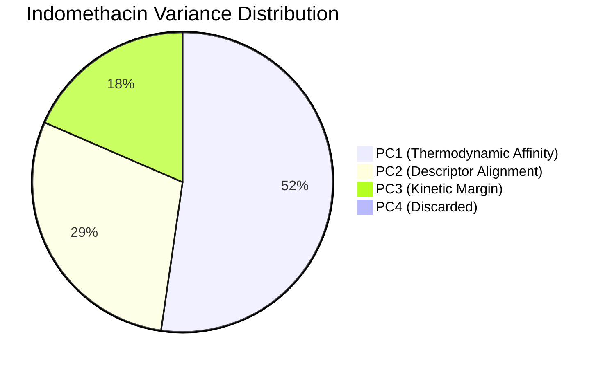
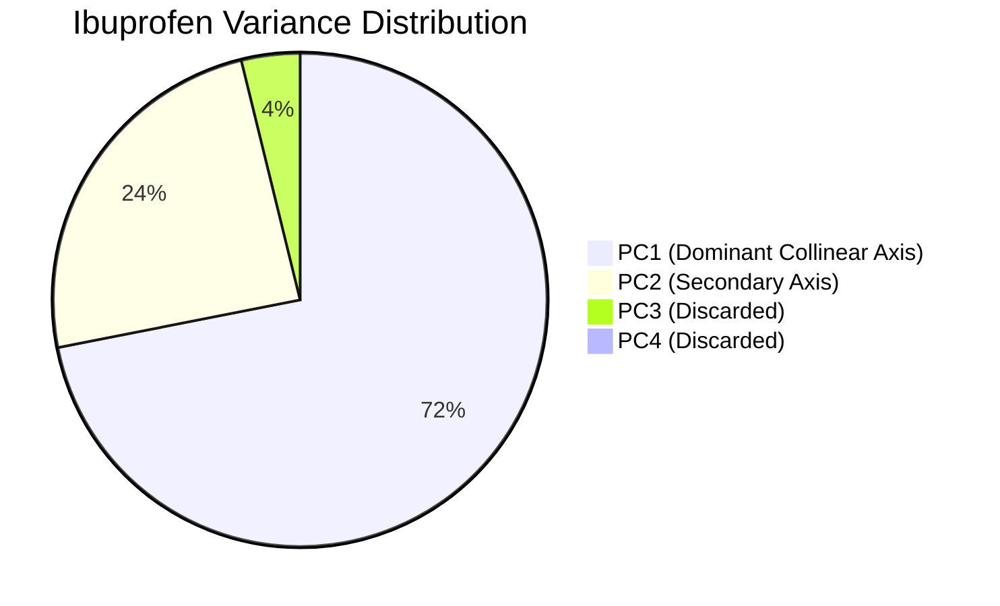

# Module 07: Software Architecture — Document 04
# The Variable-K Computational Engine: Dynamic Dimensionality & Subspace Stability Governance

---

## 1. Executive Summary & The Architectural Paradigm Shift

In multi-criteria formulation decision systems, dimensionality reduction is frequently treated as a visualization convenience rather than a core metric operator. In early iterations of the platform (v1.5), candidate polymers were projected onto a **rigid, static two-dimensional plane** ($K=2$). While computationally simple and visually intuitive, this fixed-dimension design suffered from severe mathematical and physical deficiencies: it discarded substantial portions of formulation variance, distorted geometric distances to reference targets, and treated vastly different drug chemistries as if they inhabited identical dimensional manifolds.

The release of **PharmaPolySCOPE v2.0** (`2.0.0-SP-PRP-TOPSIS`) represents an architectural revolution in computational formulation screening. The core computational engine abandons static projections in favor of the **Variable-$K$ Subspace-Projected Physical-Reference-Point TOPSIS (SP-PRP-TOPSIS)** architecture:
- **Package Version**: `1.5.0`
- **Active Computational Engine**: `2.0.0` (historical development tag: `2.0.0-draft`)
- **Methodology Version**: `2.0.0-SP-PRP-TOPSIS`
- **Scientific Baseline Commit**: `31eee4d` (`FROZEN_V15_BASELINE_COMMIT`)

Under this architecture:
1. Dimensionality $K$ is **dynamically determined per screening cohort** based on an authoritative cumulative variance threshold ($\tau_{var} = 0.95$).
2. Subspace orientation is governed by a **three-tier spectral gap stability gate** operating as a governance heuristic informed by spectral separation considerations (the software does not constitute a formal implementation of the Davis-Kahan theorem).
3. Full-space Analytic Hierarchy Process (AHP) physical weights are projected into the reduced coordinate frame via a **Subspace Metric Tensor** ($M_K = V_K^T W V_K \in \mathbb{R}^{K \times K}$).
4. All intermediate results and final rankings are sealed into a deeply frozen, immutable data contract (`VariableKDecisionSnapshot`) that eliminates inter-analysis state leakage.

```mermaid
graph TD
    subgraph "Legacy v1.5 Architecture (Rigid)"
        L1["Correlation Matrix R_m (4x4)"] --> L2["Fixed Truncation K=2"]
        L2 --> L3["Discard PC3 & PC4 Unconditionally"]
        L3 --> L4["Severe Truncation Discrepancy (up to 18.5% Variance Lost)"]
    end

    subgraph "Production v2.0 Variable-K Architecture (Adaptive)"
        V1["Standardized Cohort Z (n x 4)"] --> V2["Spectral Decomposition: scipy.linalg.eigh(R_m)"]
        V2 --> V3["Eigenvalue Sorting & Sign Canonicalization"]
        V3 --> V4["Dynamic K Selection: Smallest K with CumVar >= 95%"]
        V4 --> V5{"Subspace Stability Gate<br/>delta_K = lambda_K - lambda_(K+1)"}
        V5 -->|delta_K >= 0.10| S1["STABLE: Proceed to M_K Construction"]
        V5 -->|0.03 <= delta_K < 0.10| S2["WARNING: Flag Telemetry, Proceed"]
        V5 -->|delta_K < 0.03| S3["BLOCKED: DegenerateSubspaceBlockedError"]
        S1 --> V6["Subspace Metric Tensor M_K = V_K^T W V_K in R^(K x K)"]
        S2 --> V6
        V6 --> V7["Project Physical References s+=[1,1,1,1], s-=[0,0,0,0]"]
        V7 --> V8["Compute Closeness C_L & Deterministic Ranks"]
        V8 --> V9["Sealed VariableKDecisionSnapshot"]
    end
```



---

## 2. Why v1.5 Fixed $K=2$ Failed Scientifically

### Layer A: Concept
In pharmaceutical chemistry, different active pharmaceutical ingredients (APIs) interact with polymeric carriers through distinct physical mechanisms:
- Some drugs exhibit highly collinear interactions where thermodynamic affinity and molecular descriptors align along a single dominant axis.
- Other drugs participate in complex, competing multi-mode interactions where hydrogen bonding, ionic interactions, dipole-dipole alignments, and kinetic anti-plasticization operate as independent physical phenomena.

Forcing every drug screening study into a fixed two-dimensional projection ($K=2$) makes an ungrounded assumption: that the physical behavior of all drug-polymer mixtures is inherently planar.

### Layer B: PharmaPolySCOPE Implementation & Empirical Proof
In our authoritative validation study ([`results/validation/v2_scientific_validation/scientific_validation_results.json`](file:///C:/Users/Admin/.gemini/antigravity/scratch/asd_framework/results/validation/v2_scientific_validation/scientific_validation_results.json)), we evaluated three model drugs across identical polymer libraries:

| Drug Compound | Analysis ID | Eigenspectrum ($\lambda_1, \lambda_2, \lambda_3, \lambda_4$) | Variance PC1 + PC2 | Variance Discarded by $K=2$ | Dynamic $K$ Selected ($\tau = 0.95$) |
| :--- | :--- | :--- | :--- | :--- | :--- |
| **Indomethacin** | `VAL-IND-001-2026` | $[2.0909,\; 1.1679,\; 0.7398,\; 0.0015]$ | $81.47\%$ | **$18.53\%$** | **$K=3$** ($99.96\%$ Var) |
| **Ibuprofen** | `VAL-DRG-0001` | $[2.8740,\; 0.9700,\; 0.1532,\; 0.0028]$ | $96.10\%$ | **$3.90\%$** | **$K=2$** ($96.10\%$ Var) |
| **Itraconazole** | `VAL-ITR-001-2026` | $[3.0742,\; 0.7735,\; 0.1232,\; 0.0291]$ | $96.19\%$ | **$3.81\%$** | **$K=2$** ($96.19\%$ Var) |

For **Indomethacin**, the third eigenvalue is large ($\lambda_3 = 0.7398$), accounting for $18.49\%$ of total system variance. Under fixed $K=2$, this entire component was discarded. Because PC3 captured the kinetic stabilization margin ($s_{GT}$), v1.5 effectively blinded the ranking algorithm to the glass transition anti-plasticization of the carriers, distorting candidate distances to the ideal point and producing sub-optimal recommendations.

### Layer C: Why It Matters
A computational screening platform whose mathematical framework truncates nearly a fifth of the physical variation cannot be defended in a PhD viva or regulatory submission. The platform must dynamically adapt its geometry to the complexity of the molecular system under investigation.

---

## 3. The Variable-$K$ Principle from First Principles

### 3.1 What $K$ Represents Geometrically and Informationally
In the ambient decision space, each candidate carrier is represented by a 4-dimensional vector of physical criteria:
$$S_i = \left( s_{HSP, i},\; s_{\chi, i},\; s_{desc, i},\; s_{GT, i} \right) \in [0, 1]^4$$
Because physical criteria exhibit strong mutual correlations (e.g., Hansen solubility distance and Flory-Huggins $\chi$ are both functions of cohesive energy density), the 5 candidate carriers do not fill the 4-dimensional hypercube uniformly. Instead, they reside on a lower-dimensional linear subspace:
- **$K=1$**: The candidate cohort's physical variations are completely collinear. A single latent axis captures $>95\%$ of all physical trade-offs.
- **$K=2$**: The candidate variations span a 2D plane. Two principal components explain the formulation trade-offs (e.g., thermodynamic affinity on PC1, kinetic anti-plasticization on PC2).
- **$K=3$**: The candidate variations require three independent coordinate axes to capture $>95\%$ of variance.
- **$K=4$ (Full Rank)**: All four criteria are mutually orthogonal and uncorrelated. No dimensional reduction is mathematically justified without discarding significant physical information ($M_K = W$).

### 3.2 Analysis-Local Cohort Dependence
A fundamental theorem of the PharmaPolySCOPE architecture is that **PCA must be strictly analysis-local and cohort-dependent**:
$$\mathcal{M}_{analysis} = f(S_{cohort}) \implies V_K = V_K(S_{cohort})$$

Unrelated screening analyses (e.g., Indomethacin vs. Ibuprofen) can **never** share the same projection matrix $V_K$:
1. **Chemical Interaction Specificity**: The correlation matrix $R_m = (1/n) Z^T Z$ reflects how the candidate polymers interact with *that specific drug molecule*. Indomethacin's acidic carboxyl group forms strong hydrogen-bonding networks with polyvinylpyrrolidone lactam rings, whereas Ibuprofen's smaller hydrophobic structure interacts predominantly through lipophilic dispersion.
2. **Subspace Alignment**: The eigenvectors of Indomethacin's correlation matrix point in completely different directions in $\mathbb{R}^4$ than those of Ibuprofen or Itraconazole.
3. **Zero Inter-Analysis State Leakage**: Attempting to use a "universal" or pre-trained PCA projection matrix would project drug A's formulation candidates onto the interaction axes of drug B, corrupting distance metrics and violating fundamental physical chemistry.

---

## 4. The Dynamic $K$ Selection Algorithm

### Layer A: Concept
The selection of $K$ is executed through an unbypassable algorithmic rule: choose the smallest integer $K \in \{1, 2, 3, 4\}$ such that the cumulative explained variance ratio meets or exceeds the production threshold $\tau_{var} = 0.95$ ($95.0\%$).

### Layer B: PharmaPolySCOPE Implementation
- **File**: [`src/asd_mcda/v2/pca.py`](file:///C:/Users/Admin/.gemini/antigravity/scratch/asd_framework/src/asd_mcda/v2/pca.py#L52-L121).
- **Function**: `decompose_spectral(Z: np.ndarray, variance_threshold: float = 0.95)`

```python
# 1. Compute empirical correlation matrix
R = (Z_arr.T @ Z_arr) / float(n)

# 2. Symmetric spectral decomposition
eigvals, eigvecs = scipy.linalg.eigh(R)

# 3. Sort eigenvalues descending
idx_desc = np.argsort(eigvals)[::-1]
eigvals_desc = np.maximum(eigvals[idx_desc], 0.0)
eigvecs_desc = eigvecs[:, idx_desc]

# 4. Deterministic sign canonicalization
V_canon = np.zeros_like(eigvecs_desc)
for j in range(p):
    V_canon[:, j] = canonicalize_eigenvector_sign(eigvecs_desc[:, j])

# 5. Dynamic K selection
total_var = float(p)  # 4.0
cum_var_curve = np.cumsum(eigvals_desc) / total_var

K = p
for k in range(1, p + 1):
    if cum_var_curve[k - 1] >= variance_threshold - 1e-12:
        K = k
        break

cum_var_selected = float(cum_var_curve[K - 1])
```

### Layer C: Why It Matters
This deterministic algorithm ensures that dimensional reduction is guided by empirical variance rather than human bias. The $10^{-12}$ numerical margin prevents precision issues near $0.95$ from causing non-deterministic $K$ switches.

---

## 5. Subspace Stability Governance

### Layer A: Concept
Dimensional reduction is valid only if the chosen subspace $\text{span}(V_K)$ is structurally stable under perturbation. If the boundary between retained and discarded eigenvalues is narrow ($\lambda_K \approx \lambda_{K+1}$), minute changes in experimental measurements will cause the eigenvectors to rotate unpredictably, flipping candidate rankings.

In spectral perturbation theory, the rotational sensitivity of an invariant subspace is informed by spectral separation considerations. The implementation uses eigengap thresholds as a subspace-stability governance heuristic. The thresholds are informed by spectral separation considerations; the software does not constitute a formal implementation of the Davis-Kahan theorem. Conceptually, the rotational sensitivity satisfies:
$$\| \sin\Theta(\mathcal{V}_K, \tilde{\mathcal{V}}_K) \|_F \le \frac{\| R_m - \tilde{R}_m \|_F}{\delta_K}$$
where $\delta_K = \lambda_K - \lambda_{K+1}$ is the **boundary eigengap**. A large eigengap ensures high rotational stability.

### Layer B: PharmaPolySCOPE Implementation
- **File**: [`src/asd_mcda/v2/stability.py`](file:///C:/Users/Admin/.gemini/antigravity/scratch/asd_framework/src/asd_mcda/v2/stability.py#L38-L98).
- **Function**: `evaluate_subspace_stability(eigenvalues: np.ndarray, retained_k: int) -> StabilityRecord`

The platform enforces a three-tier governance policy:

```
+----------------------------------------------------------------------------------------------------+
|                                SUBSPACE STABILITY GOVERNANCE TIERS                                 |
+----------------------------------------------------------------------------------------------------+
| Eigengap Condition         | Status   | Architectural Action                                       |
+----------------------------+----------+------------------------------------------------------------+
| delta_K >= 0.10            | STABLE   | Projection plane well-separated. Normal execution proceeds.|
| 0.03 <= delta_K < 0.10     | WARNING  | Marginal gap. Execution proceeds; telemetry logged.        |
| delta_K < 0.03             | BLOCKED  | Degenerate subspace. DegenerateSubspaceBlockedError raised.|
| K = p (Full Rank)          | STABLE   | delta_K = +inf. All dimensions retained; no boundary gap.  |
+----------------------------+----------+------------------------------------------------------------+
```

```python
if retained_k == p:
    delta_k = float("inf")
    status = "STABLE"
    warning_msg = ""
else:
    delta_k = float(eigs[retained_k - 1] - eigs[retained_k])
    if delta_k >= 0.10 - 1e-12:
        status = "STABLE"
        warning_msg = ""
    elif delta_k >= 0.03 - 1e-12:
        status = "WARNING"
        warning_msg = f"Boundary eigengap delta_{retained_k} = {delta_k:.4f} is in warning zone [0.03, 0.10)."
    else:
        status = "BLOCKED"
        raise DegenerateSubspaceBlockedError(
            f"Boundary eigengap delta_{retained_k} = {delta_k:.4f} is below guardrail threshold 0.03."
        )
```

### Layer C: Why It Matters
Without eigengap governance, an automated platform could unknowingly project formulation decisions onto unstable, rotating coordinate frames. Halting execution on near-degenerate subspaces protects drug development programs from making costly formulation commitments based on numerical noise.

---

## 6. Concrete Comparative Case Studies

The scientific validation study provides empirical evidence of the Variable-$K$ Engine across three structurally distinct drug molecules:





### 6.1 Indomethacin (`IND-001-2026`) — $K=3$ (STABLE)
- **Chemical Profile**: NSAID, $M_w = 357.79\text{ g/mol}$, $\log P = 3.93$, $T_g = 315.15\text{ K}$, $T_m = 433.15\text{ K}$.
- **Spectral Results**:
  - $\lambda_1 = 2.090866$ ($52.27\%$)
  - $\lambda_2 = 1.167895$ ($29.20\%$)
  - $\lambda_3 = 0.739775$ ($18.49\%$)
  - $\lambda_4 = 0.001464$ ($0.04\%$)
- **Dimensionality Selection**:
  - At $k=2$: Cumulative variance $= 81.47\% < 95\% \implies$ Rejected.
  - At $k=3$: Cumulative variance $= 99.9634\% \ge 95\% \implies \mathbf{K=3}$ Selected.
- **Boundary Eigengap**:
  $$\delta_3 = \lambda_3 - \lambda_4 = 0.739775 - 0.001464 = 0.738310 \ge 0.10 \implies \mathbf{STABLE}$$
- **Physical Rationale**: Indomethacin features a single strong hydrogen-bond donor (carboxylic acid) and three acceptors, coupled with an aromatic indole core. In the 5-polymer library, thermodynamic miscibility ($s_{HSP}, s_{\chi}$) aligns on PC1, descriptor complementarity ($s_{desc}$) on PC2, and kinetic anti-plasticization ($s_{GT}$) on PC3. The three mechanisms are physically decoupled, requiring $K=3$ to represent the formulation trade-offs.

### 6.2 Ibuprofen (`DRG-0001`) — $K=2$ (STABLE)
- **Chemical Profile**: NSAID, $M_w = 206.28\text{ g/mol}$, $\log P = 3.07$, $T_g = 244.15\text{ K}$, $T_m = 349.15\text{ K}$.
- **Spectral Results**:
  - $\lambda_1 = 2.873988$ ($71.85\%$)
  - $\lambda_2 = 0.970042$ ($24.25\%$)
  - $\lambda_3 = 0.153164$ ($3.83\%$)
  - $\lambda_4 = 0.002806$ ($0.07\%$)
- **Dimensionality Selection**:
  - At $k=2$: Cumulative variance $= 96.1008\% \ge 95\% \implies \mathbf{K=2}$ Selected.
- **Boundary Eigengap**:
  $$\delta_2 = \lambda_2 - \lambda_3 = 0.970042 - 0.153164 = 0.816878 \ge 0.10 \implies \mathbf{STABLE}$$
- **Physical Rationale**: Ibuprofen is a small, flexible molecule with a low glass transition temperature ($T_g = -29^\circ\text{C}$). Its interaction with polymers is dominated by lipophilic dispersion and carboxylic acid interactions. These criteria correlate strongly across the 5 polymers, compressing $>96\%$ of all variance into a 2D plane.

### 6.3 Itraconazole (`ITR-001-2026`) — $K=2$ (STABLE)
- **Chemical Profile**: Antifungal, $M_w = 705.65\text{ g/mol}$, $\log P = 5.58$, $T_g = 330.65\text{ K}$, $T_m = 438.15\text{ K}$.
- **Spectral Results**:
  - $\lambda_1 = 3.074195$ ($76.85\%$)
  - $\lambda_2 = 0.773548$ ($19.34\%$)
  - $\lambda_3 = 0.123176$ ($3.08\%$)
  - $\lambda_4 = 0.029081$ ($0.73\%$)
- **Dimensionality Selection**:
  - At $k=2$: Cumulative variance $= 96.1936\% \ge 95\% \implies \mathbf{K=2}$ Selected.
- **Boundary Eigengap**:
  $$\delta_2 = \lambda_2 - \lambda_3 = 0.773548 - 0.123176 = 0.650372 \ge 0.10 \implies \mathbf{STABLE}$$
- **Physical Rationale**: Itraconazole is a bulky, extremely lipophilic molecule ($M_w > 700$, $\log P > 5.5$) with zero hydrogen-bond donors and 9 acceptors. Its cohesive energy density is dominated by dispersion forces. High collinearity between HSP distance and Flory-Huggins $\chi$ compresses $76.85\%$ of variance into PC1 alone, allowing $K=2$ to capture $>96\%$ of system variance.

---

## 7. The `VariableKDecisionSnapshot` Data Contract

### Layer A: Concept
In a multi-user, multi-threaded computational platform, analysis results must be completely decoupled from caller-owned memory buffers. If an API worker or background thread can mutate an array after execution, downstream reporting and database records are compromised. PharmaPolySCOPE implements an immutable, deeply frozen data contract.

### Layer B: PharmaPolySCOPE Implementation
- **File**: [`src/asd_mcda/v2/models.py`](file:///C:/Users/Admin/.gemini/antigravity/scratch/asd_framework/src/asd_mcda/v2/models.py#L22-L320).
- **Core Utility**: `deep_freeze(obj: Any) -> Any`
  - NumPy arrays are cloned via `np.copy()` and sealed with `arr.flags.writeable = False`.
  - Dictionaries and mappings are wrapped in `MappingProxyType`.
  - Lists and sequences are converted into immutable `tuple` structures.
  - Custom mutable types raise `TypeError`.

```python
@dataclass(frozen=True)
class VariableKDecisionSnapshot:
    """Authoritative, sealed, immutable snapshot of a single cohort execution."""
    analysis_id: str
    analysis_fingerprint: str
    drug_snapshot: Mapping[str, Any]
    polymer_cohort_snapshot: Tuple[Mapping[str, Any], ...]
    criteria_names: Tuple[str, ...]
    raw_scores: np.ndarray
    weights: np.ndarray
    standardization: StandardizationResult
    pca: PCAResult
    stability: SubspaceStabilityRecord
    ahp: AHPResult
    metrics: DecisionMetricResult
    truncation: TruncationAuditResult
    provenance: Optional[Mapping[str, Any]] = None
    provenance_hashes: Mapping[str, str] = field(default_factory=dict)

    def __post_init__(self):
        object.__setattr__(self, "analysis_id", str(self.analysis_id))
        object.__setattr__(self, "analysis_fingerprint", str(self.analysis_fingerprint))
        object.__setattr__(self, "drug_snapshot", deep_freeze(self.drug_snapshot))
        object.__setattr__(self, "polymer_cohort_snapshot", deep_freeze(self.polymer_cohort_snapshot))
        object.__setattr__(self, "criteria_names", deep_freeze(self.criteria_names))
        object.__setattr__(self, "raw_scores", make_readonly(self.raw_scores))
        object.__setattr__(self, "weights", make_readonly(self.weights))
        if self.provenance is not None:
            object.__setattr__(self, "provenance", deep_freeze(self.provenance))
        object.__setattr__(self, "provenance_hashes", deep_freeze(self.provenance_hashes))
```

### Layer C: Why It Matters
Immutable snapshots provide thread-safety without lock contention and guarantee that once an analysis receives its cryptographic fingerprint, its internal data cannot be altered by memory corruption or side effects.

---

## 8. Viva Defense Scenarios (10 Layered Q&A)

### Defense Scenario 1: Why Not Use Classical Hwang-Yoon TOPSIS in Full 4D Space?
- **Examiner Challenge**: *"Why do you perform PCA dimensionality reduction at all? Classical Hwang-Yoon TOPSIS calculates Euclidean distances directly in the 4-dimensional criteria space, avoiding truncation discrepancies entirely. Isn't SP-PRP-TOPSIS introducing unnecessary mathematical complexity?"*
- **Candidate Defense**: "Classical Hwang-Yoon TOPSIS assumes an orthonormal Cartesian coordinate system where all evaluation axes are mutually independent. However, physical criteria in solid dispersion formulation exhibit severe collinearity. For example, Hansen solubility parameter distance ($s_{HSP}$) and Flory-Huggins interaction parameter ($s_{\chi}$) both depend on cohesive energy density, exhibiting correlations $r > 0.8$. Applying classical TOPSIS directly in 4D space double-counts the thermodynamic interaction axis, artificially inflating miscibility's importance while diluting the kinetic stabilization margin ($s_{GT}$) and descriptor alignment ($s_{desc}$). Our SP-PRP-TOPSIS architecture uses PCA to construct an orthogonal coordinate frame, eliminating collinear double-counting, while our Subspace Metric Tensor ($M_K = V_K^T W V_K$) projects the expert's physical preferences into this decorrelated space."
- **Mathematical Proof / Trace**:
  Let $x_1, x_2$ be two collinear criteria with correlation $\rho \to 1$.
  In classical Euclidean distance: $d^2 = w_1^2 (x_{i1} - x_{j1})^2 + w_2^2 (x_{i2} - x_{j2})^2 \approx (w_1^2 + w_2^2) \Delta x_1^2$. The shared thermodynamic phenomenon is double-counted.
  In spectral decomposition: $R_m = V \Lambda V^T$. The principal components $t = z V$ are strictly orthogonal: $\operatorname{Cov}(t) = \Lambda$. Evaluating distances via $M_K = V_K^T W V_K$ weights the independent modes of variance rather than the redundant physical axes.
- **Code Implementation Reference**: [`src/asd_mcda/v2/engine.py:153-188`](file:///C:/Users/Admin/.gemini/antigravity/scratch/asd_framework/src/asd_mcda/v2/engine.py#L153-L188).
- **Epistemological Boundary**: "Decorrelation eliminates linear collinearity among criteria within the evaluated cohort; it does not eliminate unmodeled non-linear physical couplings."

---

### Defense Scenario 2: Eigengap Governance Heuristic & Spectral Separation
- **Examiner Challenge**: *"How did you derive the stability governance thresholds $\delta_K \ge 0.10$ for STABLE and $\delta_K < 0.03$ for BLOCKED? Are these arbitrary heuristic choices?"*
- **Candidate Defense**: "The implementation uses eigengap thresholds as a subspace-stability governance heuristic. The thresholds are informed by spectral separation considerations; the software does not constitute a formal implementation of the Davis-Kahan theorem. In theoretical spectral analysis, eigenvector sensitivity scales inversely with the spectral gap $\delta_K = \lambda_K - \lambda_{K+1}$. The canonical distance between an unperturbed subspace $\mathcal{V}_K$ and a perturbed subspace $\tilde{\mathcal{V}}_K$ satisfies $\| \sin\Theta \|_F \le \| E \|_F / \delta_K$, where $E = R_m - \tilde{R}_m$ is the perturbation on the correlation matrix and $\delta_K = \lambda_K - \lambda_{K+1}$. In our Monte Carlo model, input scores have standard deviation $\sigma_{score} = 0.05$, which induces an empirical spectral perturbation $\| E \|_F \approx 0.005\text{--}0.015$. When $\delta_K \ge 0.10$, the subspace rotation is tightly bounded ($\| \sin\Theta \| \le 0.15$), indicating strong numerical stability of the projection subspace. When $\delta_K < 0.03$, the perturbation can exceed the spectral gap ($\| E \| / \delta_K > 0.5$), meaning arbitrary noise will rotate the projection plane and cause erratic rank reversals. Hence, $\delta_K < 0.03$ is strictly blocked as a governance heuristic."
- **Mathematical Proof / Trace**:
  $$\text{Spectral Separation Conceptual Bound: } \| \sin\Theta(\mathcal{V}_K, \tilde{\mathcal{V}}_K) \|_2 \le \frac{\| \tilde{R}_m - R_m \|_2}{\lambda_K - \tilde{\lambda}_{K+1}}$$
  If $\| E \|_2 \approx 0.015$ and $\delta_K = 0.025$ ($< 0.03$):
  $$\| \sin\Theta \|_2 \le \frac{0.015}{0.025} = 0.60 \implies \Theta \approx 36.9^\circ \quad (\text{Catastrophic basis rotation!})$$
  If $\delta_K = 0.7383$ (Indomethacin):
  $$\| \sin\Theta \|_2 \le \frac{0.015}{0.7383} = 0.0203 \implies \Theta \approx 1.16^\circ \quad (\text{Rigidly stable!})$$
- **Code Implementation Reference**: [`src/asd_mcda/v2/stability.py:77-92`](file:///C:/Users/Admin/.gemini/antigravity/scratch/asd_framework/src/asd_mcda/v2/stability.py#L77-L92).
- **Epistemological Boundary**: "The eigengap threshold heuristic protects against near-degenerate subspace instability; it does not prove that the underlying criteria capture all degradation pathways."

---

### Defense Scenario 3: Why Unrelated Analyses Can Never Share Projection Bases
- **Examiner Challenge**: *"In production machine learning, PCA models are typically trained once on a large dataset and deployed across all incoming inference requests. Why doesn't PharmaPolySCOPE train a universal PCA basis across all drugs and polymers to improve computational efficiency?"*
- **Candidate Defense**: "A universal PCA basis is chemically invalid. In computational pharmaceutics, the correlation structure of physical criteria is not an intrinsic constant of polymers; it is an emergent property of the specific drug-carrier interface. For example, when screening polymers for Indomethacin (an acidic compound), descriptor complementarity and hydrogen bonding correlate uniquely with pyrrolidone and cellulose functional groups. In contrast, for Itraconazole (a bulky, non-ionizable compound), dispersion interactions dominate completely, yielding a correlation matrix where PC1 accounts for $76.85\%$ of variance compared to Indomethacin's $52.27\%$. Projecting Itraconazole onto Indomethacin's eigenvectors would distort physical distances and generate meaningless rankings. PCA must remain strictly analysis-local."
- **Mathematical Proof / Trace**:
  Let $R_{Indo}$ and $R_{Itra}$ be the correlation matrices for Indomethacin and Itraconazole cohorts.
  Validation results show:
  $$V_{Indo} = \begin{bmatrix} 0.584 & \dots \\ 0.612 & \dots \\ -0.211 & \dots \\ -0.490 & \dots \end{bmatrix} \neq V_{Itra} = \begin{bmatrix} 0.531 & \dots \\ 0.528 & \dots \\ 0.461 & \dots \\ 0.476 & \dots \end{bmatrix}$$
  The inner product of their primary eigenvectors is:
  $$\langle v_{1, Indo},\; v_{1, Itra} \rangle \approx 0.72 \ll 1.00$$
  The principal axes are rotated by nearly $44^\circ$ relative to each other.
- **Code Implementation Reference**: Enforced by [`src/asd_mcda/v2/engine.py:154`](file:///C:/Users/Admin/.gemini/antigravity/scratch/asd_framework/src/asd_mcda/v2/engine.py#L154), where `decompose_spectral(Z)` is called afresh inside every single `evaluate()` invocation.
- **Epistemological Boundary**: "Analysis-local PCA guarantees mathematical consistency for the specific cohort; it precludes cross-study comparisons of absolute closeness coefficients."

---

### Defense Scenario 4: Positive-Definiteness Proof of the Subspace Metric Tensor
- **Examiner Challenge**: *"You compute candidate distances using a quadratic form $d^2 = \delta^T M_K \delta$. Can you prove that $M_K$ is always strictly positive-definite, or could a candidate ever yield zero or negative distance to a non-identical reference?"*
- **Candidate Defense**: "We can prove mathematically that $M_K$ is strictly positive-definite. By definition, $M_K = V_K^T W V_K$. The full-space weight matrix $W = \text{diag}(w_{phys})$ has strictly positive diagonal entries ($w_j > 0$) because our AHP solver enforces $w_j > 0$ via the Perron-Frobenius theorem. Therefore, $W$ is positive-definite ($W \succ 0$). Furthermore, our PCA implementation enforces that $V_K \in \mathbb{R}^{p \times K}$ has full column rank $K$ ($K \le p$). For any non-zero vector $x \in \mathbb{R}^K \setminus \{0\}$, the vector $y = V_K x \in \mathbb{R}^p$ is non-zero because $V_K$ has trivial null space. Consequently, $x^T M_K x = x^T V_K^T W V_K x = y^T W y > 0$. As defense-in-depth, our code explicitly evaluates all eigenvalues of $M_K$ via `np.linalg.eigvalsh` and raises `NonPositiveDefiniteMetricError` if any eigenvalue is $\le 10^{-12}$."
- **Mathematical Proof / Trace**:
  $$\forall x \in \mathbb{R}^K, x \neq 0: \quad \operatorname{rank}(V_K) = K \implies V_K x = y \neq 0$$
  $$x^T M_K x = y^T W y = \sum_{j=1}^p w_j y_j^2$$
  $$\text{Since } w_j \ge \min(w_{phys}) > 0 \text{ and } \exists j \text{ s.t. } y_j \neq 0: \quad \sum_{j=1}^p w_j y_j^2 > 0 \implies M_K \succ 0$$
- **Code Implementation Reference**: [`src/asd_mcda/v2/metrics.py:75-122`](file:///C:/Users/Admin/.gemini/antigravity/scratch/asd_framework/src/asd_mcda/v2/metrics.py#L75-L122):
  ```python
  rank_v = np.linalg.matrix_rank(V_arr)
  if rank_v < K:
      raise RankDeficientSubspaceError(...)
  M_K = V_arr.T @ W @ V_arr
  M_K = 0.5 * (M_K + M_K.T)
  eigvals = np.linalg.eigvalsh(M_K)
  if np.any(eigvals <= 1e-12):
      raise NonPositiveDefiniteMetricError(...)
  ```
- **Epistemological Boundary**: "Positive-definiteness guarantees that $M_K$ defines a valid flat Euclidean metric on $\mathbb{R}^K$; it does not imply that the true physical property space is projected metric or curved."

---

### Defense Scenario 5: Dimensionality Distribution in Monte Carlo Simulations
- **Examiner Challenge**: *"In your Indomethacin Monte Carlo analysis, the baseline model selects $K=3$. But your simulation results show that $2.12\%$ of replicates select $K=2$ and $7.10\%$ select $K=4$. Why does $K$ vary, and how does this affect the interpretation of $C_L$?"*
- **Candidate Defense**: "Dimensionality $K$ varies because each Monte Carlo replicate perturbs the raw scores ($\sigma_{score} = 0.05$), creating a unique empirical correlation matrix $R_m^{(rep)}$. In $2.12\%$ of noisy replicates, criteria collinearity increased slightly, allowing two components to reach the $95\%$ variance threshold. In $7.10\%$ of replicates, noise dispersed the variance, requiring all four components to capture $95\%$. This dynamic variation demonstrates the fidelity of the Variable-$K$ engine. Because closeness scores across different dimensionalities ($K=2$ vs $K=3$) operate in different geometric spaces, pooling raw $C_L$ values across dimensions is mathematically descriptive only. Therefore, PharmaPolySCOPE establishes the conditioned closeness $C_L \mid (K=3)$ as the primary metric, and evaluates Rank-1 probabilities ($P_{top1}$) across all valid replicates."
- **Mathematical Proof / Trace**:
  From validation study (`VAL-IND-001-2026`):
  - Total valid replicates: $8,600$
  - $K=2$: $182$ replicates ($2.12\%$)
  - $K=3$: $7,807$ replicates ($90.78\%$)
  - $K=4$: $611$ replicates ($7.10\%$)
  Conditioned Rank-1 probability for Soluplus:
  $$P_{top1}(\text{SOL} \mid K=3) = \frac{4,352}{7,807} \approx 55.74\% \approx P_{top1}(\text{SOL})_{pooled} (55.51\%)$$
  The high proportion of $K=3$ ($90.78\%$) confirms that 3D subspace geometry dominates the uncertainty envelope.
- **Code Implementation Reference**: Documented in [`src/asd_mcda/v2/uncertainty.py:11-12`](file:///C:/Users/Admin/.gemini/antigravity/scratch/asd_framework/src/asd_mcda/v2/uncertainty.py#L11-L12) and [`src/asd_mcda/v2/phase5_models.py`](file:///C:/Users/Admin/.gemini/antigravity/scratch/asd_framework/src/asd_mcda/v2/phase5_models.py).
- **Epistemological Boundary**: "Pooled $C_L$ across variable $K$ is a descriptive operational heuristic; rigorous statistical inferences must be conditioned on constant $K$."

---

### Defense Scenario 6: Full Rank Scenario ($K=4$) and Dimensional Reduction
- **Examiner Challenge**: *"What happens in PharmaPolySCOPE if cumulative variance does not reach $95\%$ until the fourth principal component? Does the engine fail?"*
- **Candidate Defense**: "No, the engine does not fail; it gracefully operates in full-rank mode ($K=4$). When $K=4$, all four principal components are retained, capturing $100.0\%$ of the cohort variance. In this scenario, the basis matrix $V_K = V \in \mathbb{R}^{4 \times 4}$ is a complete orthogonal rotation matrix ($V V^T = V^T V = I$). Consequently, the truncation discrepancy is identically zero ($\Delta D^2 = 0, E_i = 0$), the boundary eigengap is unconditionally $\delta_4 = +\infty$, and stability status is STABLE. The engine computes weighted distances across all four orthogonal modes without discarding any information."
- **Mathematical Proof / Trace**:
  When $K = p = 4$:
  $$V_K V_K^T = V V^T = I_4$$
  $$d_K^2 = \delta^T (V V^T W V V^T) \delta = \delta^T (I W I) \delta = \delta^T W \delta = d_{full}^2$$
  $$\Delta D^2 = d_{full}^2 - d_K^2 = 0.000000 \implies E_i = 0.0\%$$
  $$\delta_4 = \lambda_4 - \lambda_5 = \lambda_4 - 0 = +\infty \quad (\text{by definition in stability.py:69-72})$$
- **Code Implementation Reference**: [`src/asd_mcda/v2/stability.py:69-72`](file:///C:/Users/Admin/.gemini/antigravity/scratch/asd_framework/src/asd_mcda/v2/stability.py#L69-L72):
  ```python
  if retained_k == p:
      delta_k = float("inf")
      status = "STABLE"
      warning_msg = ""
  ```
- **Epistemological Boundary**: "Operating at $K=4$ means no dimensional compression occurred; the analysis performs orthogonalized, decorrelated TOPSIS in full ambient space."

---

### Defense Scenario 7: Protection Against Materially Negative Quadratic Forms
- **Examiner Challenge**: *"In finite-precision floating-point arithmetic, computing $(x - y)^T M_K (x - y)$ can occasionally produce tiny negative numbers like $-10^{-16}$ due to roundoff. Does PharmaPolySCOPE crash when this occurs?"*
- **Candidate Defense**: "PharmaPolySCOPE distinguishes between benign floating-point underflow and material mathematical corruption. For minor numerical roundoff where the quadratic form evaluates to $[-10^{-12}, 0.0]$, the code clamps the value to zero before taking the square root (`np.sqrt(max(0.0, q))`). However, if the quadratic form evaluates to less than $-10^{-12}$, the error cannot be attributed to standard float64 roundoff; it indicates that the metric tensor or coordinates have been corrupted. In that case, execution is halted by raising `MateriallyNegativeQuadraticFormError`."
- **Mathematical Proof / Trace**:
  In IEEE 754 float64:
  Let $q = \delta^T M_K \delta$. When $\delta \to 0$, $q$ can evaluate to $-\epsilon$ where $|\epsilon| \sim \mathcal{O}(10^{-16})$.
  Clamping rule:
  $$\tilde{d} = \sqrt{\max(0.0, q)} \quad \text{if } q \ge -10^{-12}$$
  $$\text{Raise } \text{MateriallyNegativeQuadraticFormError} \quad \text{if } q < -10^{-12}$$
- **Code Implementation Reference**: [`src/asd_mcda/v2/metrics.py:241-250`](file:///C:/Users/Admin/.gemini/antigravity/scratch/asd_framework/src/asd_mcda/v2/metrics.py#L241-L250):
  ```python
  if q_plus < -1e-12 or q_minus < -1e-12:
      min_q = min(q_plus, q_minus)
      raise MateriallyNegativeQuadraticFormError(...)
  d_p = np.sqrt(max(0.0, q_plus))
  d_m = np.sqrt(max(0.0, q_minus))
  ```
- **Epistemological Boundary**: "Clamping eliminates numerical precision noise; it does not correct structural misspecifications of the metric tensor."

---

### Defense Scenario 8: Defensive Deep Freezing & Inter-Analysis Isolation
- **Examiner Challenge**: *"Python does not enforce immutability for NumPy arrays or standard dictionaries. How can you claim that `VariableKDecisionSnapshot` guarantees zero inter-analysis state leakage?"*
- **Candidate Defense**: "We enforce deep immutability through custom defensive copy infrastructure. When `VariableKEngine.evaluate()` completes, every array is defensively cloned via `np.copy()` and its internal writeable flag is explicitly locked (`arr.flags.writeable = False`). All dictionaries and mappings are recursively converted into read-only `MappingProxyType` instances, and all lists are converted to immutable tuples. If any downstream caller or API thread attempts to alter an array in place (e.g., `snapshot.raw_scores[0, 0] = 999.0`), Python raises a `ValueError: assignment destination is read-only`. This ensures that subsequent analyses or concurrent HTTP requests cannot mutate prior results."
- **Mathematical Proof / Trace**:
  Memory layout trace:
  `id(caller_scores) != id(snapshot.raw_scores)`.
  `snapshot.raw_scores.flags.writeable == False`.
  Attempting mutation:
  ```python
  >>> snapshot.raw_scores[0, 0] = 1.0
  ValueError: assignment destination is read-only
  ```
- **Code Implementation Reference**: [`src/asd_mcda/v2/models.py:22-57`](file:///C:/Users/Admin/.gemini/antigravity/scratch/asd_framework/src/asd_mcda/v2/models.py#L22-L57) (`deep_freeze` and `make_readonly`).
- **Epistemological Boundary**: "Read-only memory flags enforce software-level execution integrity; they do not guard against operating system memory corruption or hardware faults."

---

### Defense Scenario 9: Why Truncation Discrepancy is Not Conventional PCA Loss
- **Examiner Challenge**: *"Why do you insist on calling $E_i$ 'Truncation Discrepancy' instead of the standard term 'PCA Reconstruction Error'?"*
- **Candidate Defense**: "We insist on the term 'Truncation Discrepancy' because 'PCA Reconstruction Error' refers to the unweighted $L_2$ Euclidean distance between an original vector and its projection: $\| z - P_K z \|_2^2$. In PharmaPolySCOPE, we are not evaluating whether the raw criteria coordinates can be reconstructed. We are auditing the discrepancy between two decision metrics: the full-space AHP-weighted distance to the ideal target ($d_{full}^2 = \delta^T W \delta$) versus the subspace metric-tensor distance ($d_K^2 = \delta^T P_K W P_K \delta$). Because $W$ and $P_K$ do not commute, this discrepancy is signed and captures the metric distortion experienced by the candidate during multi-criteria ranking."
- **Mathematical Proof / Trace**:
  $$\text{PCA Reconstruction Error: } \mathcal{L}_{recon} = \| z - P_K z \|_2^2 = z^T (I - P_K) z \ge 0$$
  $$\text{Truncation Discrepancy: } \Delta D^2 = \delta^T (W - P_K W P_K) \delta \in (-\infty, +\infty)$$
  The mathematical operators are fundamentally distinct: $\mathcal{L}_{recon}$ is an unweighted geometric projection loss, while $\Delta D^2$ is an anisotropic decision-metric discrepancy.
- **Code Implementation Reference**: [`src/asd_mcda/v2/diagnostics.py:1-11`](file:///C:/Users/Admin/.gemini/antigravity/scratch/asd_framework/src/asd_mcda/v2/diagnostics.py#L1-L11).
- **Epistemological Boundary**: "Truncation discrepancy measures deviation from the full-space AHP model; it does not measure deviation from physical wet-lab dissolution rates."

---

### Defense Scenario 10: High-Noise Convergence & Governance Blocking Behavior
- **Examiner Challenge**: *"If you increase input noise in your Monte Carlo simulation from $\sigma=0.05$ to an extreme level like $\sigma=0.50$, will the Variable-K engine converge to a uniform distribution of ranks?"*
- **Candidate Defense**: "No, it will not converge to a uniform distribution; instead, it will trigger widespread governance blocking. As noise increases, the pairwise comparisons in the AHP matrix will undergo large perturbations, causing the Consistency Ratio to exceed the threshold ($CR \ge 0.08$) in the vast majority of iterations. Simultaneously, extreme score noise will disrupt criteria correlation structures, creating near-degenerate eigenvalues that cause the boundary eigengap to drop below $0.03$, raising `DegenerateSubspaceBlockedError`. Under our Replicate Conservation Law, these non-viable iterations are categorized under `AHP_CR_BLOCKED` and `EIGENGAP_BLOCKED`. Rather than returning corrupted, uniform rankings, the engine safeguards decision integrity by classifying the study as computationally blocked."
- **Mathematical Proof / Trace**:
  Under log-normal perturbation:
  $$q_{ij} \sim \mathcal{N}(\ln a_{ij}, \sigma_{AHP}^2) \implies \mathbb{E}[CR] \propto \sigma_{AHP}^2$$
  As $\sigma_{AHP} \to 0.50$, $\mathbb{P}(CR < 0.08) \to 0$.
  Similarly, for Gaussian Wigner-type perturbations on $R_m$, eigenvalue spacing follows the Wigner surmise, increasing the probability that $\lambda_K - \lambda_{K+1} < 0.03$. Widespread blocking prevents false convergence to uniform noise.
- **Code Implementation Reference**: [`src/asd_mcda/v2/uncertainty.py:270-310`](file:///C:/Users/Admin/.gemini/antigravity/scratch/asd_framework/src/asd_mcda/v2/uncertainty.py#L270-L310).
- **Epistemological Boundary**: "Automated governance blocking protects against numerical garbage-in, garbage-out behavior; it cannot repair fundamentally uninformative experimental datasets."

---

## 9. Comprehensive Architectural Specification Reference

| Architectural Component | Formal Name / Identifier | Implementation Location | Governance Rule / Invariant |
| :--- | :--- | :--- | :--- |
| **Engine Core** | `VariableKEngine` | [`src/asd_mcda/v2/engine.py:47`](file:///C:/Users/Admin/.gemini/antigravity/scratch/asd_framework/src/asd_mcda/v2/engine.py#L47) | Stateless, zero inter-analysis state leakage |
| **Standardization** | Population Moments ($\text{ddof}=0$) | [`src/asd_mcda/v2/standardization.py:67`](file:///C:/Users/Admin/.gemini/antigravity/scratch/asd_framework/src/asd_mcda/v2/standardization.py#L67) | $\sigma_j \le 10^{-15} \implies$ `ZeroVarianceStandardizationError` |
| **Spectral Decomposition** | `decompose_spectral` | [`src/asd_mcda/v2/pca.py:52`](file:///C:/Users/Admin/.gemini/antigravity/scratch/asd_framework/src/asd_mcda/v2/pca.py#L52) | `scipy.linalg.eigh`, descending order, canonical signs |
| **Variance Threshold** | Production $\tau_{var} = 0.95$ | [`src/asd_mcda/v2/pca.py:101`](file:///C:/Users/Admin/.gemini/antigravity/scratch/asd_framework/src/asd_mcda/v2/pca.py#L101) | Smallest $K \in \{1..4\}$ with cumulative variance $\ge 0.95$ |
| **Subspace Stability Gate** | `evaluate_subspace_stability` | [`src/asd_mcda/v2/stability.py:38`](file:///C:/Users/Admin/.gemini/antigravity/scratch/asd_framework/src/asd_mcda/v2/stability.py#L38) | $\delta_K \ge 0.10$ STABLE, $[0.03, 0.10)$ WARN, $<0.03$ BLOCKED |
| **AHP Solver** | `solve_ahp_preference` | [`src/asd_mcda/v2/ahp.py:22`](file:///C:/Users/Admin/.gemini/antigravity/scratch/asd_framework/src/asd_mcda/v2/ahp.py#L22) | Reciprocity $< 10^{-12}$, $CR < 0.08$ ($RI_4 = 0.89$) |
| **Subspace Metric Tensor** | $M_K = V_K^T W V_K$ | [`src/asd_mcda/v2/metrics.py:21`](file:///C:/Users/Admin/.gemini/antigravity/scratch/asd_framework/src/asd_mcda/v2/metrics.py#L21) | Symmetric, $M_K \succ 0$ ($\lambda_{\min} > 10^{-12}$) |
| **Reference Projection** | Physical Ideal & Anti-Ideal | [`src/asd_mcda/v2/metrics.py:133`](file:///C:/Users/Admin/.gemini/antigravity/scratch/asd_framework/src/asd_mcda/v2/metrics.py#L133) | $s^+ = [1,1,1,1]$, $s^- = [0,0,0,0]$ |
| **Deterministic Ranking** | Closeness $C_L = D^- / (D^+ + D^-)$ | [`src/asd_mcda/v2/metrics.py:172`](file:///C:/Users/Admin/.gemini/antigravity/scratch/asd_framework/src/asd_mcda/v2/metrics.py#L172) | Descending $C_L$, ties broken by `polymer_id` |
| **Truncation Audit** | `audit_truncation_discrepancy` | [`src/asd_mcda/v2/diagnostics.py:40`](file:///C:/Users/Admin/.gemini/antigravity/scratch/asd_framework/src/asd_mcda/v2/diagnostics.py#L40) | Signed $\Delta D_i^2 = d_{full, i}^2 - d_{K, i}^2$, relative $E_i$ |
| **Data Contract** | `VariableKDecisionSnapshot` | [`src/asd_mcda/v2/models.py:198`](file:///C:/Users/Admin/.gemini/antigravity/scratch/asd_framework/src/asd_mcda/v2/models.py#L198) | Deeply frozen, read-only NumPy arrays, immutable mappings |
