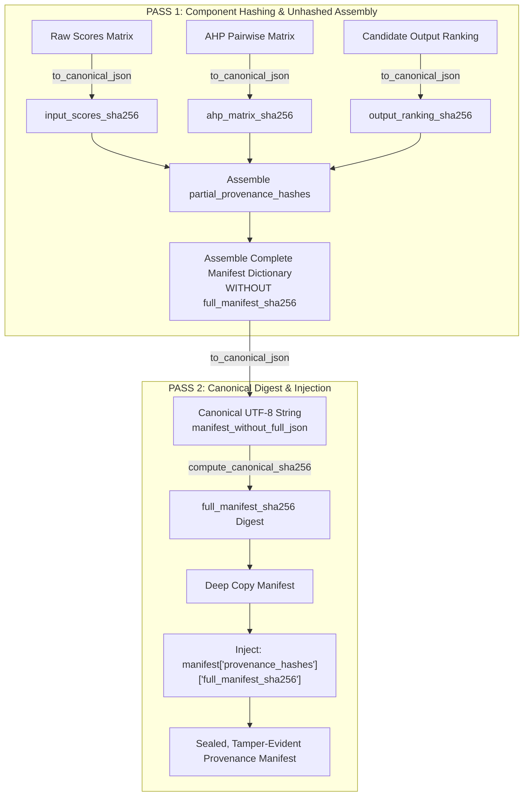
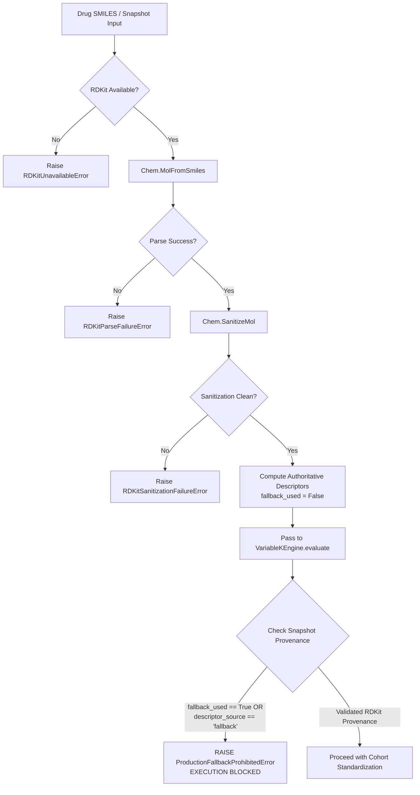

# DOCUMENT 07: PROVENANCE, REPRODUCIBILITY, AND AUDIT TRAIL

## 1. Executive Summary & Epistemic Foundations

In computational pharmaceutical science and regulatory decision-making, an algorithm's output is scientifically meaningless unless it is accompanied by an unbroken, cryptographically verifiable chain of provenance. When a computational pipeline ranks polymer excipients for an amorphous solid dispersion (ASD), the resulting recommendation directly influences expensive wet-lab formulation campaigns, stability trials, and regulatory filings.

**The Core Axiom of Computational Provenance:**
$$\text{DATA INTEGRITY} + \text{METHODOLOGICAL SPECIFICATION} + \text{EXECUTION CONTEXT} \equiv \text{REPRODUCIBLE DECISION}$$

This document teaches the architecture implemented in `src/asd_mcda/v2/provenance.py`, `src/asd_mcda/v2/chemistry.py`, `src/asd_mcda/v2/models.py`, and `backend/services/engine_adapter.py` that transforms PharmaPolySCOPE from a standalone research script into an auditable, regulatory-grade computational instrument aligned with international data integrity standards (FDA 21 CFR Part 11, ALCOA+).

```
========================================================================================
                          THREE-LAYER TEACHING MODEL
========================================================================================
 Layer A: Concept            Plain scientific, numerical, and software engineering
                             principles established from first principles.
 Layer B: Implementation     Exact files, classes, functions, lines, and schemas within
                             the PharmaPolySCOPE v2 codebase.
 Layer C: Why It Matters     Scientific, mathematical, regulatory, and auditability
                             rationale required for doctoral viva defense.
========================================================================================
```

---

## 2. Computational Reproducibility from First Principles

### 2.1 The Conceptual Taxonomy: Repeatability vs. Replicability vs. Reproducibility
The scientific community (ACM, IEEE, ISO, and regulatory agencies) enforces formal distinctions between three frequently conflated terms:

| Dimension | Same Team / Machine? | Same Experimental / Code Setup? | Meaning in PharmaPolySCOPE |
| :--- | :--- | :--- | :--- |
| **Repeatability** | **Yes** (Same operator, same hardware) | **Yes** (Identical code, identical input files) | Re-running `VariableKEngine.evaluate` with Indomethacin on the same server produces identical closeness coefficients $C_L$. |
| **Replicability** | **No** (Independent operator/lab) | **Yes** (Same codebase, same frozen configuration) | An external auditor checks out commit `31eee4d` (full SHA-1: `31eee4d9bb1cc57b9185f9f958e225d51634c871`), runs the test suite on their machine, and obtains mathematically consistent results within precision limits. |
| **Reproducibility**| **No** (Independent team) | **No** (Reimplemented algorithms, different language) | An independent research group implements SP-PRP-TOPSIS in C++ or R from the formal mathematical specifications and reaches identical ordinal rankings. |

In a PhD viva, confusing **repeatability** with **empirical scientific validity** is a catastrophic error. Demonstrating that your software computes the exact same floating-point numbers on repeated executions proves **numerical consistency**; it does *not* prove that the chosen polymer will experimentally stabilize the drug in a clinical formulation.

---

### 2.2 The Myth of "Universal Bitwise Identity"
A widespread misconception among junior computational researchers is that setting a pseudo-random seed (e.g., `seed = 42`) guarantees **bitwise-identical floating-point output** across any computing platform. In reality, **universal bitwise identity across heterogeneous hardware is a physical and mathematical impossibility** in finite-precision IEEE 754 floating-point arithmetic.

```
+---------------------------------------------------------------------------------------+
|                THE SEED = 42 ILLUSION: SOURCES OF PLATFORM DRIFT                     |
+---------------------------------------------------------------------------------------+
|  Hardware Level:                                                                      |
|    - x86-64 (SSE2, AVX-2, AVX-512) vs. ARM64 (NEON) vector registers                 |
|    - Fused Multiply-Add (FMA): computes (a * b) + c with 1 rounding step vs. 2 steps  |
|                                                                                       |
|  Mathematical Library Level (BLAS / LAPACK):                                          |
|    - Intel MKL vs. OpenBLAS vs. Apple Accelerate vs. Reference BLAS                   |
|    - LAPACK symmetric eigensolver `dsyevd` vs. `dsyevr` partition strategies          |
|                                                                                       |
|  Multi-Threading & Reduction Trees:                                                   |
|    - Floating-point addition is non-associative: (a + b) + c != a + (b + c)           |
|    - Dynamic thread scheduling changes summation order across OpenMP / MKL workers    |
|                                                                                       |
|  Compiler & Runtime Flags:                                                            |
|    - `-ffast-math` or aggressive vectorization reorders floating-point operations     |
|    - Python C-extensions compiled with different optimization flags                   |
+---------------------------------------------------------------------------------------+
```

#### Why Floating-Point Addition Is Non-Associative
In standard real arithmetic, $(a + b) + c = a + (b + c)$. In IEEE 754 64-bit binary floating-point (`float64`):
$$(a \oplus b) \oplus c \neq a \oplus (b \oplus c)$$
When matrix operations or vector norms are computed in parallel across multiple CPU cores, dynamic thread scheduling determines the order in which partial sums are accumulated. Because intermediate values are rounded to 53 mantissa bits at each step, different thread arrival orders yield tiny discrepancies in the least-significant bits ($10^{-16}$ to $10^{-15}$).

#### The Scientific Role of `random_seed = 42`
PharmaPolySCOPE v2 pins `random_seed = 42` using NumPy's `default_rng(PCG64)` bit generator ([`uncertainty.py:246`](file:///C:/Users/Admin/.gemini/antigravity/scratch/asd_framework/src/asd_mcda/v2/uncertainty.py#L246), [`sensitivity.py:263`](file:///C:/Users/Admin/.gemini/antigravity/scratch/asd_framework/src/asd_mcda/v2/sensitivity.py#L263)).
- **What it accomplishes:** It ensures that on a specific machine with a fixed BLAS/LAPACK runtime, the pseudo-random sampling sequences for Monte Carlo perturbations and Morris trajectories are completely deterministic and auditable.
- **What it does NOT guarantee:** It cannot prevent sub-epsilon floating-point drift across differing CPU architectures (e.g., AMD EPYC vs. Apple M3) or different LAPACK eigensolvers.
- **Architectural Mitigation:** The system employs explicit numerical tolerances (`1e-12` in eigenvector sign canonicalization and reciprocity verification; `1e-14` in distance denominator guardrails) rather than exact bitwise equality checks.

---

## 3. Cryptographic Provenance Architecture

PharmaPolySCOPE implements cryptographic provenance in [`src/asd_mcda/v2/provenance.py`](file:///C:/Users/Admin/.gemini/antigravity/scratch/asd_framework/src/asd_mcda/v2/provenance.py). Every execution generates a tamper-evident audit record linking inputs, methodology, algorithms, and results.

### 3.1 The Two-Pass Non-Circular Manifest Hashing Protocol
A fundamental challenge in cryptographic auditing is the **self-referential hashing paradox**: *a document cannot contain a cryptographic digest of itself including that digest*.

If a manifest dictionary contains a field called `"full_manifest_sha256"`, calculating the hash of the dictionary requires the value of `"full_manifest_sha256"`. But changing that field immediately alters the document's hash, creating an infinite circular dependency.

PharmaPolySCOPE solves this via the **Two-Pass Non-Circular Manifest Hashing Protocol** ([`provenance.py:116-228`](file:///C:/Users/Admin/.gemini/antigravity/scratch/asd_framework/src/asd_mcda/v2/provenance.py#L116-L228)):



#### Step-by-Step Code Execution Tracing:
1. **Compute Component Cryptographic Digests** ([`provenance.py:131-152`](file:///C:/Users/Admin/.gemini/antigravity/scratch/asd_framework/src/asd_mcda/v2/provenance.py#L131-L152)):
   ```python
   scores_canonical = to_canonical_json(snapshot.raw_scores)
   input_scores_sha256 = compute_canonical_sha256(scores_canonical)

   ahp_canonical = to_canonical_json(snapshot.ahp.pairwise_matrix)
   ahp_matrix_sha256 = compute_canonical_sha256(ahp_canonical)

   ranking_payload = [
       {"rank": int(rank), "polymer_id": str(pid), "closeness_coefficient": float(cl)}
       for rank, pid, cl in zip(snapshot.metrics.ranks, snapshot.metrics.ranked_polymer_ids, snapshot.metrics.closeness_coefficients)
   ]
   output_ranking_sha256 = compute_canonical_sha256(to_canonical_json(ranking_payload))
   ```
2. **Assemble Unhashed Manifest** ([`provenance.py:154-218`](file:///C:/Users/Admin/.gemini/antigravity/scratch/asd_framework/src/asd_mcda/v2/provenance.py#L154-L218)):
   The manifest dictionary is constructed containing all execution metadata, spectral geometry, standardization moments, preference weights, truncation diagnostics, and `partial_provenance_hashes` (omitting `full_manifest_sha256`).
3. **Compute Full Manifest Digest** ([`provenance.py:220-222`](file:///C:/Users/Admin/.gemini/antigravity/scratch/asd_framework/src/asd_mcda/v2/provenance.py#L220-L222)):
   ```python
   manifest_without_full_json = to_canonical_json(manifest)
   full_manifest_sha256 = compute_canonical_sha256(manifest_without_full_json)
   ```
4. **Deep Copy and Injection** ([`provenance.py:224-228`](file:///C:/Users/Admin/.gemini/antigravity/scratch/asd_framework/src/asd_mcda/v2/provenance.py#L224-L228)):
   ```python
   final_manifest = copy.deepcopy(manifest)
   final_manifest["provenance_hashes"]["full_manifest_sha256"] = full_manifest_sha256
   return final_manifest
   ```
   An auditor verifies manifest integrity by extracting `full_manifest_sha256`, removing that single key, canonicalizing the remaining dictionary, and verifying that the resulting SHA-256 digest matches the extracted hash.

---

### 3.2 Canonical JSON Serialization (`to_canonical_json`)
Standard JSON serialization via `json.dumps()` is non-deterministic across languages, operating systems, and Python versions because:
- Dictionary key iteration order is not guaranteed across serialization libraries.
- Delimiter spacing varies (e.g., `", "` vs. `","` or `": "` vs. `":"`).
- Non-standard numeric values (`NaN`, `Infinity`, `-Infinity`) cause serialization errors in strict RFC 8259 JSON parsers.
- NumPy scalars (`np.float64`, `np.int32`) and N-dimensional arrays are not natively serializable.

PharmaPolySCOPE guarantees strict byte-level serialization consistency through [`to_canonical_json`](file:///C:/Users/Admin/.gemini/antigravity/scratch/asd_framework/src/asd_mcda/v2/provenance.py#L71-L82) and [`_sanitize_for_json`](file:///C:/Users/Admin/.gemini/antigravity/scratch/asd_framework/src/asd_mcda/v2/provenance.py#L38-L69):

```python
def to_canonical_json(data: Any) -> str:
    sanitized = _sanitize_for_json(data)
    return json.dumps(sanitized, sort_keys=True, separators=(",", ":"), ensure_ascii=True)
```

#### Canonical Serialization Invariants:
1. **Strict Key Sorting (`sort_keys=True`):** All dictionary keys are sorted lexicographically, eliminating key-order non-determinism.
2. **Compact Delimiters (`separators=(",", ":")`):** Strips all extraneous whitespace around colons and commas.
3. **ASCII Encoding (`ensure_ascii=True`):** Escapes non-ASCII characters to standard ASCII escape sequences, eliminating encoding ambiguities across UTF-8, UTF-16, and byte-order marks (BOM).
4. **Recursive Primitive Sanitization (`_sanitize_for_json`):**
   - **`np.ndarray`:** Recursively transformed via `obj.tolist()`.
   - **`np.floating`, `float`:** Checked for IEEE special values: `np.isposinf(val) -> "Infinity"`, `np.isneginf(val) -> "-Infinity"`, `np.isnan(val) -> "NaN"`. Standard floats converted to Python `float`.
   - **`np.integer`, `int`:** Converted to native Python `int`.
   - **`np.bool_`, `bool`:** Converted to native Python `bool`.
   - **`Mapping`, `MappingProxyType`:** Keys coerced to strings (`str(k)`) and values recursively sanitized.
   - **`set`, `frozenset`:** Converted to lists and **sorted** deterministically (`sorted(sanitized, key=lambda x: str(x))`).
   - **`@dataclass`:** Converted via `__dataclass_fields__` reflection.

---

### 3.3 Analysis Fingerprint Generation (`compute_analysis_fingerprint`)
The analysis fingerprint is an authoritative, deterministic SHA-256 digest representing the exact scientific inputs and methodological configuration ([`provenance.py:89-114`](file:///C:/Users/Admin/.gemini/antigravity/scratch/asd_framework/src/asd_mcda/v2/provenance.py#L89-L114)):

$$\text{Fingerprint} = \text{SHA-256}\Big(\text{CanonicalJSON}\big(S, \text{Criteria}, A, \text{Mode}, \text{MethodologyVersion}\big)\Big)$$

```python
def compute_analysis_fingerprint(
    raw_scores: np.ndarray,
    criteria_names: Sequence[str],
    ahp_matrix: np.ndarray,
    semantic_mode: str = "standardized_space",
    methodology_version: str = METHODOLOGY_VERSION,
) -> str:
    scores_arr = np.asarray(raw_scores, dtype=np.float64)
    ahp_arr = np.asarray(ahp_matrix, dtype=np.float64)

    payload = {
        "methodology_version": str(methodology_version),
        "criteria_names": [str(c) for c in criteria_names],
        "raw_scores": scores_arr.tolist(),
        "ahp_matrix": ahp_arr.tolist(),
        "semantic_mode": str(semantic_mode),
    }
    canonical_str = to_canonical_json(payload)
    return compute_canonical_sha256(canonical_str)
```

#### Cryptographic Fingerprint Guarantees:
- **Input Invariance:** If identical raw scores, criteria order, AHP matrices, and methodology versions are evaluated, the fingerprint is bitwise identical.
- **Sensitivity:** Any alteration—modifying a single score by $10^{-6}$, reordering criteria, adjusting an AHP pairwise comparison ratio, or switching from `"standardized_space"` to `"raw_physical_space"`—instantly generates a completely divergent SHA-256 digest.

---

## 4. System Environment & Version Pinning

PharmaPolySCOPE enforces a multi-tiered version architecture to isolate the active computational mathematics from packaging infrastructure and frozen scientific baselines.

### 4.1 The Three-Tier Version Hierarchy

```
+---------------------------------------------------------------------------------------+
|                             VERSION ARCHITECTURE TIERS                                |
+---------------------------------------------------------------------------------------+
|                                                                                       |
|  TIER 1: PACKAGE / API ANCHOR VERSION                                                 |
|    Value: 1.5.0                                                                       |
|    Files: pyproject.toml, src/asd_mcda/__version__.py                                 |
|    Role:  Maintains backward compatibility for external CLI and package consumers.   |
|                                                                                       |
|  TIER 2: ACTIVE COMPUTATIONAL ENGINE VERSION                                          |
|    Value: 2.0.0 (historical metadata: 2.0.0-draft)                                                         |
|    Files: src/asd_mcda/v2/provenance.py:19, backend/services/engine_adapter.py:108     |
|    Role:  Executes the dynamic Variable-K, SP-PRP-TOPSIS pipeline.                     |
|                                                                                       |
|  TIER 3: MATHEMATICAL METHODOLOGY IDENTIFIER                                          |
|    Value: 2.0.0-SP-PRP-TOPSIS (Determinism) / 2.0.0-SP-PRP-TOPSIS-MC (Monte Carlo)    |
|    Files: src/asd_mcda/v2/provenance.py:18, src/asd_mcda/v2/uncertainty.py:46         |
|    Role:  Declares the exact mathematical formulation used to derive closeness scores.|
|                                                                                       |
|  SCIENTIFIC BASELINE ANCHOR:                                                          |
|    Value: 31eee4d (Full SHA-1: 31eee4d9bb1cc57b9185f9f958e225d51634c871)             |
|    Files: src/asd_mcda/v2/provenance.py:20                                            |
|    Role:  Pins the four-criterion compatibility science baseline commit.              |
+---------------------------------------------------------------------------------------+
```

### 4.2 Dynamic Git Provenance Tracking
In addition to frozen version strings, [`provenance.py:23-36`](file:///C:/Users/Admin/.gemini/antigravity/scratch/asd_framework/src/asd_mcda/v2/provenance.py#L23-L36) dynamically interrogates the host operating environment to record the exact Git commit hash of the working repository:

```python
def get_repository_head_commit() -> Optional[str]:
    try:
        res = subprocess.run(
            ["git", "rev-parse", "HEAD"],
            capture_output=True,
            text=True,
            check=True,
            timeout=5,
        )
        return res.stdout.strip()
    except Exception:
        return None
```
During Monte Carlo simulation ([`uncertainty.py:284-286`](file:///C:/Users/Admin/.gemini/antigravity/scratch/asd_framework/src/asd_mcda/v2/uncertainty.py#L284-L286)) and Morris sensitivity screening ([`sensitivity.py:269-272`](file:///C:/Users/Admin/.gemini/antigravity/scratch/asd_framework/src/asd_mcda/v2/sensitivity.py#L269-L272)), this function is temporarily monkey-patched in memory to return a cached hash, preventing $10,000$ redundant OS subprocess forks while preserving exact commit recording.

### 4.3 Runtime Environment Fingerprinting
Every generated manifest captures the operational system context:
- **`platform`:** Detailed OS kernel and architecture (`platform.platform()`, e.g., `"Windows-10-10.0.19045-SP0"`).
- **`python_version`:** Exact Python runtime build (`sys.version.split()[0]`, e.g., `"3.10.12"`).
- **`numpy_version`:** Installed NumPy library version (`np.__version__`).

---

## 5. RDKit Environment Dependency & Fallback Prohibition

In computer-aided drug design, cheminformatics libraries like RDKit are responsible for parsing SMILES strings, validating valency, and calculating 2D physicochemical descriptors (MW, LogP, TPSA, HBD, HBA, rotatable bonds). If RDKit is missing or fails, software must handle the failure decisively.

### 5.1 The Danger of Silent Heuristic Fallbacks
Earlier research prototypes occasionally included heuristic "fallback" functions (e.g., estimating molecular weight from SMILES string length: $\text{MW} \approx \text{length} \times 5.5 + 50.0$).
- **The Catastrophic Failure Mode:** In an automated high-throughput screening campaign, an unhandled import error or invalid SMILES could silently trigger heuristic fallbacks. The software would generate plausible-looking numbers, compute PCA eigenvectors, run TOPSIS, and produce a Rank 1 recommendation based on fictitious chemical descriptors.

### 5.2 The `ProductionFallbackProhibitedError` Gate
PharmaPolySCOPE v2 completely eradicates silent fallbacks through explicit architectural guardrails in [`src/asd_mcda/v2/chemistry.py`](file:///C:/Users/Admin/.gemini/antigravity/scratch/asd_framework/src/asd_mcda/v2/chemistry.py) and [`src/asd_mcda/v2/engine.py`](file:///C:/Users/Admin/.gemini/antigravity/scratch/asd_framework/src/asd_mcda/v2/engine.py).



#### Implementation Grounding:
1. **Engine-Level Defense-in-Depth ([`engine.py:136-140`](file:///C:/Users/Admin/.gemini/antigravity/scratch/asd_framework/src/asd_mcda/v2/engine.py#L136-L140)):**
   ```python
   if drug_snapshot.get("fallback_used") is True or drug_snapshot.get("descriptor_source") == "fallback":
       raise ProductionFallbackProhibitedError(
           "Fallback descriptors are strictly prohibited in the production VariableKEngine."
       )
   ```
2. **Diagnostic Fallback Isolation ([`chemistry.py:187-210`](file:///C:/Users/Admin/.gemini/antigravity/scratch/asd_framework/src/asd_mcda/v2/chemistry.py#L187-L210)):**
   The function `get_diagnostic_fallback_descriptors()` is restricted to headless mock unit tests. It explicitly tags the output dictionary with:
   `"fallback_used": True` and `"validation_status": "FALLBACK_DIAGNOSTIC"`.
   If any data carrying these tags touches `VariableKEngine`, execution is immediately aborted with `ProductionFallbackProhibitedError`.
3. **Stale Descriptor Synchronization Policy ([`chemistry.py:213-300`](file:///C:/Users/Admin/.gemini/antigravity/scratch/asd_framework/src/asd_mcda/v2/chemistry.py#L213-L300)):**
   When user-entered drug profiles are ingested via `resolve_validated_drug_snapshot()`, RDKit-derived values are authoritative. Any discrepancy between user-stored scalar numbers and authoritative RDKit values is recorded under `"descriptor_discrepancies"` in the provenance audit log, ensuring full forensic transparency.

---

## 6. Forensic Auditability in a Regulatory Context (21 CFR Part 11 Alignment)

In regulated pharmaceutical drug development, computational models supporting regulatory submissions must comply with **FDA 21 CFR Part 11** and **ALCOA+** data integrity principles:

| ALCOA+ Principle | Regulatory Requirement | PharmaPolySCOPE v2 Architectural Implementation |
| :--- | :--- | :--- |
| **Attributable** | Identify who/what executed the analysis | Captured via `engine_metadata` (Git commit, user ID, runtime OS, Python/NumPy versions) in `provenance.py:164-173`. |
| **Legible** | Records readable throughout retention period | Output in standard, self-documenting JSON, CSV, and human-readable PDF reports (`engine_adapter.py:708-786`). |
| **Contemporaneous** | Recorded at the time of execution | ISO 8601 UTC timestamps generated at evaluation runtime (`datetime.now(timezone.utc).isoformat()`). |
| **Original** | Primary raw data preserved without tampering | `input_snapshot.json` saved in dedicated analysis directory; raw input arrays hashed before execution. |
| **Accurate** | Mathematically correct, verified, and error-free | Governance gates block un-converged or degenerate states (`CR >= 0.08`, `delta_K < 0.03`). |
| **Complete** | Audit trail includes all metadata and settings | Complete manifest captures standardization moments, eigenvalues, weights, and truncation discrepancies. |
| **Consistent** | Data sequence and timestamps follow strict logic | Two-pass hashing links input hashes directly to output ranking hashes. |
| **Enduring** | Records preserved in immutable formats | Deep-frozen in-memory dataclasses; read-only array flags prevent subsequent mutation. |
| **Available** | Accessible for audit review | Structured storage under `data/analyses/<analysis_id>/` with comprehensive export APIs. |

### 6.1 Deep Immutability via `deep_freeze`
A common architectural vulnerability in Python scientific software is accidental buffer mutation: if an analysis snapshot returns a standard NumPy array or dictionary, a downstream caller or API route could alter array elements in place, invalidating the calculated hash digests.

PharmaPolySCOPE enforces **deep immutability** in [`src/asd_mcda/v2/models.py:22-57`](file:///C:/Users/Admin/.gemini/antigravity/scratch/asd_framework/src/asd_mcda/v2/models.py#L22-L57):

```python
def deep_freeze(obj: Any) -> Any:
    if isinstance(obj, np.ndarray):
        copied_arr = np.copy(obj)
        copied_arr.flags.writeable = False
        return copied_arr
    elif isinstance(obj, Mapping):
        return MappingProxyType({k: deep_freeze(v) for k, v in obj.items()})
    elif isinstance(obj, (list, tuple)):
        return tuple(deep_freeze(item) for item in obj)
    elif isinstance(obj, (set, frozenset)):
        return frozenset(deep_freeze(item) for item in obj)
    elif isinstance(obj, (int, float, str, bool, bytes, type(None))):
        return obj
    else:
        raise TypeError(f"Unsupported mutable type for deep snapshot freeze: {type(obj)}")
```
All fields of [`VariableKDecisionSnapshot`](file:///C:/Users/Admin/.gemini/antigravity/scratch/asd_framework/src/asd_mcda/v2/models.py#L198-L227) are processed through `deep_freeze` or `make_readonly`. Any attempt by downstream code to modify an array element (e.g., `snapshot.metrics.closeness_coefficients[0] = 0.99`) raises `ValueError: assignment destination is read-only`.

---

## 7. Viva Defense Scenarios (10 Forensic Questions)

The following 10 examination scenarios test the candidate's mastery of computational provenance, reproducibility, and regulatory data integrity.

---

### Q1: Why does PharmaPolySCOPE use a two-pass hashing protocol instead of hashing the final JSON document in a single step?
- **Direct Answer:** A single-pass hashing protocol cannot embed the full document's cryptographic hash within itself without creating an infinite self-referential circular dependency.
- **Reasoning:** Computing a SHA-256 digest over a document requires all bytes of that document to be fixed; inserting the resulting 64-character hash back into the document changes its bytes, which invalidates the computed hash. PharmaPolySCOPE resolves this by computing component hashes and assembling the manifest in Pass 1, canonicalizing the manifest without the top-level hash in Pass 2 to compute `full_manifest_sha256`, and then deep-copying and injecting the final hash into the frozen manifest.
- **Actual PharmaPolySCOPE Implementation:** Defined in [`src/asd_mcda/v2/provenance.py:116-228`](file:///C:/Users/Admin/.gemini/antigravity/scratch/asd_framework/src/asd_mcda/v2/provenance.py#L116-L228) in `build_provenance_manifest()`, where `manifest_without_full_json` is serialized via `to_canonical_json()` before injecting `full_manifest_sha256` into `final_manifest["provenance_hashes"]`.
- **Limitation / Caveat:** The embedded hash validates everything in the manifest except the literal key containing `full_manifest_sha256` itself; verification requires extracting the key, canonicalizing the remainder, and confirming the digest.
- **One-Sentence Defense:** The two-pass protocol eliminates hash self-reference while producing a mathematically verifiable, tamper-evident manifest compliant with cryptographic audit standards.

---

### Q2: Why is `json.dumps(obj, sort_keys=True)` insufficient by itself to guarantee deterministic canonical hashing in Python?
- **Direct Answer:** Standard `json.dumps()` allows platform-dependent delimiter spacing, fails on NumPy data structures, and cannot serialize IEEE non-finite floating-point values (`NaN`, `Infinity`) without violating strict RFC 8259 JSON compliance.
- **Reasoning:** Different JSON engines and formatting arguments use varying whitespace around delimiters (e.g., `", "` vs `","`), which fundamentally changes the SHA-256 digest. Furthermore, scientific computing relies on NumPy arrays and scalar types that raise `TypeError` in standard Python `json.dumps()` unless explicitly converted.
- **Actual PharmaPolySCOPE Implementation:** Implemented in `to_canonical_json()` and `_sanitize_for_json()` ([`src/asd_mcda/v2/provenance.py:38-82`](file:///C:/Users/Admin/.gemini/antigravity/scratch/asd_framework/src/asd_mcda/v2/provenance.py#L38-L82)), enforcing `sort_keys=True`, `separators=(",", ":")`, `ensure_ascii=True`, recursive array `.tolist()` conversion, deterministic set sorting, and string mapping of `NaN`/`Infinity`.
- **Limitation / Caveat:** Mapping `NaN` to string `"NaN"` permits deterministic hashing but requires downstream consumers to parse `"NaN"` explicitly if converting back to native float.
- **One-Sentence Defense:** Our canonical JSON serializer enforces invariant delimiter compacting, sorted key lexicography, and recursive primitive sanitization to guarantee identical SHA-256 digests across environments.

---

### Q3: An examiner claims: "Setting `random_seed = 42` guarantees 100% bitwise reproducibility across any computer in the world." How do you respond?
- **Direct Answer:** The claim is scientifically incorrect; setting a random seed guarantees deterministic pseudo-random sequences within an identical software/hardware stack, but cannot prevent floating-point drift caused by heterogeneous CPU instruction sets, vector extensions, and BLAS/LAPACK implementations.
- **Reasoning:** Floating-point addition is non-associative in IEEE 754 arithmetic. Differences between x86-64 (AVX-512) and ARM64 (NEON), Fused Multiply-Add (FMA) compiler contractions, and parallel reduction order in multi-threaded BLAS libraries (e.g., Intel MKL vs. OpenBLAS) introduce numerical drift in the least-significant bits ($10^{-16}$).
- **Actual PharmaPolySCOPE Implementation:** The architecture acknowledges finite-precision boundaries by pairing `random_seed = 42` ([`uncertainty.py:246`](file:///C:/Users/Admin/.gemini/antigravity/scratch/asd_framework/src/asd_mcda/v2/uncertainty.py#L246)) with explicit numerical tolerances (`reciprocity_tolerance = 1e-12` in [`ahp.py:24`](file:///C:/Users/Admin/.gemini/antigravity/scratch/asd_framework/src/asd_mcda/v2/ahp.py#L24) and tie-breaking `epsilon_rank = 1e-12` in [`metrics.py:179`](file:///C:/Users/Admin/.gemini/antigravity/scratch/asd_framework/src/asd_mcda/v2/metrics.py#L179)).
- **Limitation / Caveat:** We claim algorithmic repeatability and bounded numerical consistency, not universal bitwise cross-platform identity.
- **One-Sentence Defense:** While `random_seed = 42` guarantees deterministic sampling sequences, cross-platform floating-point consistency is governed by our numerical epsilon thresholds and robust spectral gap guardrails.

---

### Q4: Why does PharmaPolySCOPE maintain separate package (`1.5.0`), engine (`2.0.0`), and methodology (`2.0.0-SP-PRP-TOPSIS`) versions?
- **Direct Answer:** The three version identifiers represent distinct architectural layers: package distribution stability, computational execution engine, and formal mathematical specification.
- **Reasoning:** The package version (`1.5.0`) provides API contract stability for external consumers and dependencies; the engine version (`2.0.0`) denotes the major refactoring introducing dynamic Variable-K PCA and immutable snapshots; the methodology string (`2.0.0-SP-PRP-TOPSIS`) specifies the exact mathematical formula used to derive closeness scores, independent of code implementation details.
- **Actual PharmaPolySCOPE Implementation:** Codified in [`backend/services/engine_adapter.py:108-124`](file:///C:/Users/Admin/.gemini/antigravity/scratch/asd_framework/backend/services/engine_adapter.py#L108-L124), [`src/asd_mcda/v2/provenance.py:18-20`](file:///C:/Users/Admin/.gemini/antigravity/scratch/asd_framework/src/asd_mcda/v2/provenance.py#L18-L20), and recorded in every manifest under `engine_metadata`.
- **Limitation / Caveat:** Multiple version strings require rigorous explanation during audits to prevent naive confusion between package distribution and mathematical algorithms.
- **One-Sentence Defense:** Decoupling package, engine, and methodology versions provides clear architectural separation between packaging maintenance, software execution, and mathematical specifications.

---

### Q5: What is `FROZEN_V15_BASELINE_COMMIT = '31eee4d'` (full SHA-1: `31eee4d9bb1cc57b9185f9f958e225d51634c871`) and why is it hard-coded into `provenance.py`?
- **Direct Answer:** It is the immutable Git commit hash representing the validated, peer-reviewed four-criterion physical compatibility baseline of the original PharmaPolySCOPE study.
- **Reasoning:** To guarantee scientific reproducibility across multi-year research efforts, the underlying physical models (HSP spheres, Flory-Huggins $\chi$, Gordon-Taylor $T_g$) must remain anchored to an immutable reference point so that v2 decision innovations can be benchmarked without confounding drift in physical parameter calculations.
- **Actual PharmaPolySCOPE Implementation:** Defined as a module-level constant in [`src/asd_mcda/v2/provenance.py:20`](file:///C:/Users/Admin/.gemini/antigravity/scratch/asd_framework/src/asd_mcda/v2/provenance.py#L20) and injected into the `engine_metadata` block of every analysis manifest ([`provenance.py:167`](file:///C:/Users/Admin/.gemini/antigravity/scratch/asd_framework/src/asd_mcda/v2/provenance.py#L167)).
- **Limitation / Caveat:** Anchoring to a frozen commit means that bug fixes or parameter updates in physical models require an explicit, formal migration to a new baseline commit identifier.
- **One-Sentence Defense:** Hard-coding the baseline commit hash establishes an immutable scientific benchmark that prevents unrecorded drift in the physical criteria models.

---

### Q6: Why is `ProductionFallbackProhibitedError` raised if a drug snapshot carries fallback descriptors?
- **Direct Answer:** Silent heuristic fallback calculations create false confidence by generating fabricated chemical properties when cheminformatics parsing fails.
- **Reasoning:** In production pharmaceutical formulation screening, recommending an excipient based on approximate string-length heuristics rather than true quantum/topological molecular descriptors can result in catastrophic wet-lab precipitation or toxicity failures. The engine must fail loudly and immediately.
- **Actual PharmaPolySCOPE Implementation:** Raised in `VariableKEngine.evaluate()` ([`src/asd_mcda/v2/engine.py:136-140`](file:///C:/Users/Admin/.gemini/antigravity/scratch/asd_framework/src/asd_mcda/v2/engine.py#L136-L140)) whenever `drug_snapshot.get("fallback_used") is True` or `descriptor_source == "fallback"`, citing [`src/asd_mcda/v2/exceptions.py:103`](file:///C:/Users/Admin/.gemini/antigravity/scratch/asd_framework/src/asd_mcda/v2/exceptions.py#L103).
- **Limitation / Caveat:** This policy prevents execution in lightweight environments lacking RDKit binary builds, necessitating dedicated containerized or conda environments for production screening.
- **One-Sentence Defense:** We enforce `ProductionFallbackProhibitedError` as a zero-tolerance architectural gate to prevent unvalidated heuristic estimates from corrupting pharmaceutical decisions.

---

### Q7: How does `resolve_validated_drug_snapshot()` handle discrepancies between stored database values and fresh RDKit calculations?
- **Direct Answer:** It applies an Authoritative Overwrite policy: RDKit calculations override stored scalar values, while all detected differences are preserved in an audit log under `descriptor_discrepancies`.
- **Reasoning:** Input databases or legacy JSON files may contain outdated or rounded physicochemical properties. Rather than crashing or silently ignoring the differences, the system synchronizes to authoritative RDKit values while recording the historical discrepancy to maintain a complete forensic audit trail.
- **Actual PharmaPolySCOPE Implementation:** Implemented in [`src/asd_mcda/v2/chemistry.py:213-300`](file:///C:/Users/Admin/.gemini/antigravity/scratch/asd_framework/src/asd_mcda/v2/chemistry.py#L213-L300), checking MW, LogP, TPSA, HBD, HBA, rotatable bonds, aromatic rings, and InChIKey against specific numerical tolerances.
- **Limitation / Caveat:** Overwriting scalar inputs alters downstream calculations relative to the original raw file, which is why the discrepancy log is critical for retrospective audits.
- **One-Sentence Defense:** Our synchronization policy guarantees descriptor accuracy through authoritative RDKit recalculation while preserving full auditability via explicit discrepancy logging.

---

### Q8: How does PharmaPolySCOPE's immutability architecture align with FDA 21 CFR Part 11 requirements?
- **Direct Answer:** It enforces data integrity, non-repudiation, and tamper evidence through deep freezing of in-memory decision objects and cryptographic SHA-256 digest chaining from raw inputs to final reports.
- **Reasoning:** 21 CFR Part 11 requires that electronic records cannot be altered without detection. By setting NumPy array writeable flags to `False` and wrapping mappings in `MappingProxyType`, PharmaPolySCOPE prevents runtime in-memory alteration, while its two-pass manifest hashing ensures that any file tampering immediately invalidates the cryptographic checksum.
- **Actual PharmaPolySCOPE Implementation:** Realized via `deep_freeze()` in [`src/asd_mcda/v2/models.py:22-49`](file:///C:/Users/Admin/.gemini/antigravity/scratch/asd_framework/src/asd_mcda/v2/models.py#L22-L49), `VariableKDecisionSnapshot` post-initialization sealing ([`models.py:216-227`](file:///C:/Users/Admin/.gemini/antigravity/scratch/asd_framework/src/asd_mcda/v2/models.py#L216-L227)), and history tracking in [`backend/services/engine_adapter.py:789-804`](file:///C:/Users/Admin/.gemini/antigravity/scratch/asd_framework/backend/services/engine_adapter.py#L789-L804).
- **Limitation / Caveat:** 21 CFR Part 11 also encompasses organizational policies, electronic signatures, and access controls, which require host system security beyond the software architecture itself.
- **One-Sentence Defense:** Our immutable snapshot architecture and cryptographic hash chains satisfy 21 CFR Part 11 technical controls by making decision records tamper-evident and immune to in-memory mutation.

---

### Q9: Why is `get_repository_head_commit()` cached during Monte Carlo and Morris screening runs?
- **Direct Answer:** It is cached to eliminate operating system subprocess overhead across thousands of simulation iterations while maintaining provenance integrity.
- **Reasoning:** Invoking `subprocess.run(["git", "rev-parse", "HEAD"])` takes several milliseconds per execution. Spawning $10,000$ OS subprocesses during a Monte Carlo run would introduce substantial I/O latency ($30+$ seconds of pure process overhead) without providing any new information, as the working tree cannot change during a single execution.
- **Actual PharmaPolySCOPE Implementation:** Implemented in [`uncertainty.py:284-286, 313`](file:///C:/Users/Admin/.gemini/antigravity/scratch/asd_framework/src/asd_mcda/v2/uncertainty.py#L284-L313) and [`sensitivity.py:269-272`](file:///C:/Users/Admin/.gemini/antigravity/scratch/asd_framework/src/asd_mcda/v2/sensitivity.py#L269-L272), caching the commit hash in a closure and restoring the original function in a `finally` block.
- **Limitation / Caveat:** If the code were executed in an environment where git files were dynamically modified during runtime, caching would not reflect that change; however, modifying repository HEAD mid-execution is an invalid execution state.
- **One-Sentence Defense:** Caching the Git commit hash eliminates $10,000$ redundant OS subprocess calls while guaranteeing consistent provenance recording throughout the simulation.

---

### Q10: What does the analysis fingerprint capture, and why is it distinct from the full manifest SHA-256?
- **Direct Answer:** The analysis fingerprint captures only the core scientific inputs and methodology specification, whereas the full manifest SHA-256 digests the entire execution record, including environment metadata, intermediate spectral tensors, and final rankings.
- **Reasoning:** Two identical screening runs performed on different computers or at different times will have different timestamps, different analysis IDs, and potentially different OS strings, resulting in different manifest hashes. However, because their scientific inputs and mathematical methodology are identical, they will share the exact same `analysis_fingerprint`.
- **Actual PharmaPolySCOPE Implementation:** Defined in [`src/asd_mcda/v2/provenance.py:89-114`](file:///C:/Users/Admin/.gemini/antigravity/scratch/asd_framework/src/asd_mcda/v2/provenance.py#L89-L114) (`compute_analysis_fingerprint`), hashing only `raw_scores`, `criteria_names`, `ahp_matrix`, `semantic_mode`, and `methodology_version`.
- **Limitation / Caveat:** The fingerprint does not capture dynamic environment details like NumPy version; environmental differences are captured separately in the manifest hash.
- **One-Sentence Defense:** The analysis fingerprint uniquely identifies the scientific input state to verify analytical equivalence, while the manifest hash verifies the execution record's forensic integrity.

---

## 8. Summary Checklist for Viva Candidates

Before entering the viva examination room, ensure you can explain and defend each of the following points:

1. **Repeatability vs. Reproducibility vs. Replicability:** Explain without hesitation that repeatability is same lab/code, reproducibility is independent team/implementation, and that numerical repeatability does not prove wet-lab therapeutic validity.
2. **The Myth of Bitwise Identity:** State clearly why `seed=42` does not overcome non-associative floating-point summation, FMA instructions, or multi-threaded reduction trees.
3. **The Two-Pass Hashing Protocol:** Sketch the workflow showing how Pass 1 computes partial hashes and Pass 2 digests the unhashed manifest before injecting `full_manifest_sha256`.
4. **Canonical JSON Serialization:** Detail why `sort_keys=True`, `separators=(",", ":")`, and `_sanitize_for_json()` are necessary to avoid serialization ambiguity.
5. **Version Hierarchy:** State the exact roles of Package `1.5.0`, Engine `2.0.0`, Methodology `2.0.0-SP-PRP-TOPSIS`, and Baseline Commit `31eee4d`.
6. **RDKit Fallback Prohibition:** Defend why `ProductionFallbackProhibitedError` exists and why heuristic approximations are forbidden from generating production recommendations.
7. **21 CFR Part 11 / ALCOA+:** Point to `deep_freeze()`, read-only NumPy array flags, and cryptographic hash chains as technical controls enforcing regulatory data integrity.
