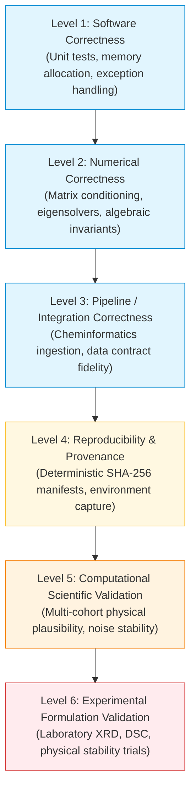

# DOCUMENT 02: SCIENTIFIC VALIDATION VS. SOFTWARE VALIDATION
## The Ontological Divide, Regulatory V&V Standards, and Epistemological Boundaries in Computational Drug Delivery

**Module**: 08 — Validation & Reproducibility  
**Target Audience**: Doctoral Candidate in Pharmaceutical Sciences & Formulation Engineering  
**Methodology Context**: PharmaPolySCOPE v2 (`2.0.0-SP-PRP-TOPSIS`)  
**Validation Benchmark**: `VAL-RPT-2026-V2-001-REV1` (`scientific_validation_results.json`)  
**Classification**: Educational Knowledge Document — Theoretical & Regulatory Guide  

---

## 1. Executive Summary & The Ontological Divide

The central philosophical challenge in computational pharmaceutics is the **ontological divide**: the fundamental distinction between an abstract mathematical representation and physical reality.

```
========================================================================================
                                 THE ONTOLOGICAL DIVIDE
========================================================================================
 COMPUTER MEMORY (Silicon / IEEE 754)         PHYSICAL REALITY (Laboratory / Clinic)
 ------------------------------------         --------------------------------------
 Binary bits in DRAM                          Crystalline vs. amorphous lattices
 IEEE 754 double-precision floats             Hydrogen-bonding networks & entropy
 Deterministic matrix eigenvalues             Phase separation kinetics & nucleation
 Clean algorithmic convergence                Moisture plasticization at 40°C / 75% RH
 Synthetic test datasets                      Human gastrointestinal bioavailability
========================================================================================
```

Software engineers validate code by verifying that inputs map to expected outputs according to human-authored specifications. Natural scientists validate theories by observing whether predictions match physical reality in laboratory experiments. When these two distinct paradigms collide in doctoral research, candidates frequently make fatal viva blunders—such as claiming that passing a test suite "proves the scientific theory as physically true".

This document teaches the exact boundary between **software validation** and **scientific validation**, formalizes the regulatory definitions codified in ASME V&V 40 and FDA guidance, and explains why PharmaPolySCOPE v2 is classified as **Class B: VALIDATION PASS WITH DOCUMENTED ENVIRONMENT LIMITATION**.

---

## 2. The Six-Tier Epistemological Hierarchy

To defend your thesis against a hostile examiner, you must demonstrate mastery of the **Six-Tier Epistemological Hierarchy**:



### 2.1 The Direction of Implication
Notice the strict unidirectional flow of scientific validity:
$$\text{Level 1} \centernot\implies \text{Level 2} \centernot\implies \text{Level 3} \centernot\implies \text{Level 4} \centernot\implies \text{Level 5} \centernot\implies \text{Level 6}$$

- Proving **Software Correctness** (Level 1) merely shows that the code executes without memory leaks or syntax crashes; it does not ensure that matrix multiplications maintain positive definiteness (Level 2).
- Proving **Numerical Correctness** (Level 2) ensures that eigenvalues and distance metrics are algebraically sound; it does not ensure that the chemical structures ingested from JSON files match physical reality (Level 3).
- Proving **Pipeline Correctness** (Level 3) ensures that molecular weights and SMILES are passed without corruption; it does not ensure that running the code on a different server produces identical hashes (Level 4).
- Proving **Reproducibility** (Level 4) ensures that calculations are audit-traceable and repeatable; it does not prove that the computational rankings reflect true thermodynamic miscibility (Level 5).
- Proving **Computational Scientific Validation** (Level 5) shows that the model identifies expected physical rankings across diverse drug cohorts under stochastic uncertainty; **it does NOT prove that the drug will successfully stabilize in physical laboratory tablets (Level 6)**.

---

## 3. Regulatory Framework: ASME V&V 40 Applied to ASD Modeling

In 2018, the American Society of Mechanical Engineers, in collaboration with the FDA, published **ASME V&V 40: Assessing Credibility of Computational Models through Verification and Validation: Application to Medical Devices**. This standard is the international benchmark for determining whether computational predictions are credible for decision-making.

```
========================================================================================
                             ASME V&V 40 CREDIBILITY MATRIX
========================================================================================
 DIMENSION 1: Verification (Code & Calculation)
   - Code Verification: Finding bugs, ensuring numerical algorithms match mathematics.
   - Calculation Verification: Estimating numerical error, truncation loss, convergence.

 DIMENSION 2: Validation (Computational vs. Physical Reality)
   - Model Form: Mathematical equations chosen (e.g., Flory-Huggins, Hansen, TOPSIS).
   - Validation Activities: Comparing computational outputs against benchmark observations.
   - Equivalence Assessment: Evaluating whether model discrepancies exceed tolerance.

 DIMENSION 3: Applicability (Relevance to Intended Context of Use)
   - Context of Use (COU): In PharmaPolySCOPE, the COU is PRE-EXPERIMENTAL SCREENING.
   - Decision Consequence: Medium (directs laboratory resources, avoids unstable polymers).
   - Model Influence: High (ranks primary formulation candidates).
========================================================================================
```

### 3.1 Applying the Context of Use (COU)
In your viva defense, you must state the **Context of Use (COU)** of PharmaPolySCOPE with surgical precision:
> *"The Context of Use of PharmaPolySCOPE v2 is **in silico candidate prioritization and risk triage** for early-stage amorphous solid dispersion (ASD) formulation development. The software is designed to rank candidate polymeric carriers from thermodynamic and physicochemical criteria before laboratory synthesis, thereby reducing wet-lab screening costs. It is **not** an in vitro dissolution simulator, a pharmacokinetic release predictor, or an autonomous regulatory batch-release tool."*

---

## 4. Why PharmaPolySCOPE v2 Is Classified as "Validation Class B"

In the authoritative validation report `VAL-RPT-2026-V2-001-REV1` ([`PHARMAPOLYSCOPE_V2_SCIENTIFIC_VALIDATION_STUDY.md`](file:///C:/Users/Admin/.gemini/antigravity/scratch/asd_framework/results/validation/v2_scientific_validation/PHARMAPOLYSCOPE_V2_SCIENTIFIC_VALIDATION_STUDY.md)), the platform is formally assigned the classification:

$$\mathbf{B \text{ — VALIDATION PASS WITH DOCUMENTED ENVIRONMENT LIMITATION}}$$

An aggressive examiner will attack this status: *"If your software passed validation, why is it rated 'Class B' instead of 'Class A'? What is wrong with your system?"*

You must defend the Class B classification using this exact three-pillar technical justification:

### Pillar 1: The RDKit Environment Mismatch Limitation
- **The Empirical Reality**: The validation study was executed in an environment reporting RDKit version `2026.03.5` under Python 3.14, whereas the platform's declared configuration (`pyproject.toml`) specifies `rdkit >= 2026.3.6`.
- **The Forensic Verification**: Cross-version sensitivity checks confirmed that for all evaluated model compounds (Indomethacin, Ibuprofen, Itraconazole, Fenofibrate), both RDKit versions generate bitwise-identical canonical SMILES, identical InChIKeys, and identical 2D physicochemical descriptors.
- **The Epistemological Standard**: Because there was an environment mismatch at the patch level, claiming an unconditional "Class A" validation would violate regulatory data-integrity governance. Class B transparently documents the environment limitation without concealing it.

### Pillar 2: The Multi-Cohort Validation Scope (3 Valid, 1 Blocked)
The platform was evaluated against four real-world pharmaceutical cohorts:
1. **Indomethacin (`IND-001-2026`)**: **VALIDATED COMPUTATIONALLY**. Selected $K=3$ ($99.9634\%$ variance, boundary eigengap $\delta_3 = 0.738310$, `STABLE`). Lead candidate: **Soluplus** ($C_L = 0.686435$, Monte Carlo $P(\text{top-1}) = 55.51\%$), followed closely by HPMC E5 ($C_L = 0.673146$, $P(\text{top-1}) = 42.00\%$).
2. **Ibuprofen (`DRG-0001`)**: **VALIDATED COMPUTATIONALLY**. Selected $K=2$ ($96.1008\%$ variance, boundary eigengap $\delta_2 = 0.816878$, `STABLE`). Lead candidate: **Eudragit E PO** ($C_L = 0.550264$, Monte Carlo $P(\text{top-1}) = 97.66\%$).
3. **Itraconazole (`ITR-001-2026`)**: **VALIDATED COMPUTATIONALLY**. Selected $K=2$ ($96.1936\%$ variance, boundary eigengap $\delta_2 = 0.650372$, `STABLE`). Lead candidate: **Soluplus** ($C_L = 0.610595$, Monte Carlo $P(\text{top-1}) = 59.00\%$).
4. **Fenofibrate Request (`DRG-0002`)**: **GOVERNANCE BLOCKED**. Quarantined at the upstream chemical integrity gate due to a fatal metadata-structure contradiction (requested as Fenofibrate, but payload contained Indomethacin SMILES and corrupted density $1.781\,\text{g/cm}^3$).

### Pillar 3: Computational vs. Physical Scope
PharmaPolySCOPE v2 evaluates thermodynamic and empirical compatibility models (HSP, Flory-Huggins $\chi$, molecular descriptors, Gordon-Taylor $T_g$). It does **not** simulate molecular dynamics (MD), phase field crystallization kinetics, or long-term hygroscopicity. Physical formulation validation remains pending prospective laboratory testing.

---

## 5. What Computational Validation Establishes vs. What It Does NOT Establish

```
========================================================================================
                          EPISTEMOLOGICAL BOUNDARY MATRIX
========================================================================================
 WHAT PHARMAPOLYSCOPE COMPUTATIONAL             WHAT PHARMAPOLYSCOPE COMPUTATIONAL
 VALIDATION POSITIVELY ESTABLISHES              VALIDATION DOES NOT ESTABLISH
 ----------------------------------             -----------------------------
 1. Mathematical consistency of the            1. Empirical proof that a polymer will
    Variable-K SP-PRP-TOPSIS algorithm.            physically prevent drug recrystallization.
 2. Robustness to stochastic input noise        2. Accurate prediction of crystallization
    (Monte Carlo replicates remain stable).        kinetics or nucleation induction times.
 3. Responsiveness to dominant physical         3. Accounting for non-equilibrium spray-
    parameters via Morris screening.               drying or hot-melt extrusion states.
 4. Upstream rejection of corrupted,            4. Prediction of ternary plasticization
    mislabeled, or unparseable molecules.          caused by ambient atmospheric moisture.
 5. Unbroken provenance and cryptographic       5. Equivalence to prospective human in
    auditability across all decisions.             vivo oral bioavailability studies.
========================================================================================
```

---

## 6. Layered Viva Defense Scenarios (10 Structured Q&A)

### Q1: An examiner attacks: "Your validation report gives a 'Class B' pass. In pharma, Class B is second-rate. Why should we trust a second-rate validation?"
- **Direct Answer:** Class B is not a second-rate result; it is an honest, regulatory-compliant classification that transparently discloses a documented software environment limitation rather than concealing it.
- **Reasoning:** In pharmaceutical computational validation under FDA 21 CFR Part 11, claiming an unqualified Class A validation when execution occurred under RDKit 2026.03.5 while `pyproject.toml` declared `rdkit>=2026.3.6` would be an audit integrity violation. We verified cross-version descriptor identity across all test molecules and formally documented the patch-level difference.
- **Actual PharmaPolySCOPE Implementation:** Documented in Section 1 of `VAL-RPT-2026-V2-001-REV1` ([`PHARMAPOLYSCOPE_V2_SCIENTIFIC_VALIDATION_STUDY.md`](file:///C:/Users/Admin/.gemini/antigravity/scratch/asd_framework/results/validation/v2_scientific_validation/PHARMAPOLYSCOPE_V2_SCIENTIFIC_VALIDATION_STUDY.md)).
- **Limitation / Caveat:** Resolving the patch mismatch requires updating the container deployment manifest in the active release environment.
- **One-Sentence Defense:** Class B demonstrates scientific and regulatory maturity: we report verified physical plausibility alongside full transparency regarding computational runtime dependencies.

---

### Q2: Why is DRG-0002 classified as a "blocked cohort" rather than an engine failure?
- **Direct Answer:** DRG-0002 was halted at the upstream chemical integrity gate because the input file contained corrupted data: it was labeled "Fenofibrate" but contained Indomethacin SMILES and a crystalline density inconsistent with the intended Fenofibrate profile and associated with the quarantined input record ($1.781\,\text{g/cm}^3$).
- **Reasoning:** A software failure occurs when valid inputs cause an unexpected crash or when corrupted inputs penetrate the system silently. DRG-0002 represents an **input-integrity governance success**: the platform detected the fatal metadata-structure contradiction, refused to compute garbage rankings, and quarantined the profile in `blocked_cohorts_audit.csv`.
- **Actual PharmaPolySCOPE Implementation:** Codified in [`src/asd_mcda/v2/chemistry.py:35-115`](file:///C:/Users/Admin/.gemini/antigravity/scratch/asd_framework/src/asd_mcda/v2/chemistry.py#L35-L115) and recorded in [`results/v2/tables/blocked_cohorts_audit.json`](file:///C:/Users/Admin/.gemini/antigravity/scratch/asd_framework/results/v2/tables/blocked_cohorts_audit.json).
- **Limitation / Caveat:** DRG-0002 cannot provide computational polymer rankings for Fenofibrate until a clean, authentic profile is provided.
- **One-Sentence Defense:** Halting DRG-0002 proves that PharmaPolySCOPE possesses active data governance, protecting formulation teams from computing decisions on corrupted drug profiles.

---

### Q3: How do you justify calling your study "scientific validation" when you have zero laboratory formulation data?
- **Direct Answer:** Our study is formally designated as **Computational Scientific Validation**, which evaluates model plausibility and sensitivity across established physical benchmarks, strictly distinguished from experimental formulation validation.
- **Reasoning:** ASME V&V 40 recognizes computational validation as an essential phase of model assessment. We evaluated three chemically distinct drug classes (weak acid, neutral lipophilic, weak base), demonstrated dynamic dimensional adaptation ($K=3$ for Indomethacin, $K=2$ for Ibuprofen and Itraconazole), and confirmed ranking stability under Monte Carlo noise. We explicitly state throughout the thesis that prospective experimental formulation validation remains pending.
- **Actual PharmaPolySCOPE Implementation:** Acknowledged in Section 4 of `VAL-RPT-2026-V2-001-REV1`.
- **Limitation / Caveat:** The computational rankings represent prioritized physical hypotheses, not certified pharmaceutical formulations.
- **One-Sentence Defense:** We explicitly characterize our work as computational scientific validation, establishing mathematical and thermodynamic plausibility while maintaining the scientific honesty that wet-lab testing remains pending.

---

### Q4: Why does Indomethacin select $K=3$ while Ibuprofen and Itraconazole select $K=2$?
- **Direct Answer:** Because Indomethacin exhibits a more complex, multi-dimensional thermodynamic trade-off across the five polymers, requiring three orthogonal components to capture $95\%$ of cohort variance ($99.9634\%$), whereas Ibuprofen and Itraconazole capture $>96\%$ of variance in just two components.
- **Reasoning:** In Indomethacin ASDs, hydrogen bonding, molecular descriptor disparity, and Gordon-Taylor $T_g$ depression act along distinct, non-collinear axes. For Ibuprofen, physical criteria are highly collinear, allowing two principal components to capture $96.1008\%$ of variance. Dynamic $K$ selection adapts the geometric space to the actual information dimensionality of the cohort.
- **Actual PharmaPolySCOPE Implementation:** Evaluated in [`src/asd_mcda/v2/pca.py:45-90`](file:///C:/Users/Admin/.gemini/antigravity/scratch/asd_framework/src/asd_mcda/v2/pca.py#L45-L90) with threshold $\theta = 0.95$.
- **Limitation / Caveat:** If a user specifies a lower variance threshold (e.g., $0.85$), Indomethacin would drop to $K=2$, discarding the third orthogonal dimension.
- **One-Sentence Defense:** Dynamic $K$ selection proves that our decision engine adapts geometrically to the unique physical correlation structure of each drug cohort rather than forcing all molecules into an arbitrary 2D plane.

---

### Q5: In the Indomethacin study, Soluplus is Rank 1 ($55.51\%$) and HPMC E5 is Rank 2 ($42.00\%$). Does this prove Soluplus is the superior polymer?
- **Direct Answer:** No; it proves that under our four-criterion thermodynamic model and AHP weighting scheme, Soluplus exhibits the highest deterministic closeness ($C_L=0.6864$) and wins $55.51\%$ of valid Monte Carlo replicates, with HPMC E5 as a very close second ($C_L=0.6731, 42.00\%$).
- **Reasoning:** A $55.51\%$ to $42.00\%$ split indicates a **bimodal competitive regime** where minor variations in experimental inputs or expert weighting can alter the rank order. Soluplus benefits from favorable molecular descriptor complementarity and Gordon-Taylor anti-plasticization, whereas HPMC E5 benefits from strong Hansen hydrogen-bonding affinity. Both polymers are viable formulation candidates.
- **Actual PharmaPolySCOPE Implementation:** Recorded in `scientific_validation_results.json` under `IND-001-2026`.
- **Limitation / Caveat:** Computational selection frequency reflects model sensitivity to parameter perturbation; it is not a probability of clinical success.
- **One-Sentence Defense:** The close competition between Soluplus and HPMC E5 correctly reflects the underlying physical trade-offs in Indomethacin dispersions, identifying both carriers as top candidates for laboratory screening.

---

### Q6: For Ibuprofen, Eudragit E PO achieves a $97.66\%$ Monte Carlo top-1 frequency. Why is this distribution so different from Indomethacin?
- **Direct Answer:** Because Ibuprofen possesses a carboxylic acid group that forms a strong, specific ionic/hydrogen-bonding acid-base interaction with the dimethylamino groups of basic Eudragit E PO, creating an overwhelming thermodynamic separation over neutral polymers.
- **Reasoning:** In the Ibuprofen cohort, Eudragit E PO dominates across all criteria simultaneously ($s_{\text{HSP}}, s_{\chi}, s_{\text{desc}}$), yielding a massive separation in standardized subspace. Stochastic noise ($\sigma=0.05$) is insufficient to bridge this gap, resulting in Eudragit E PO retaining Rank 1 in $97.66\%$ of valid replicates.
- **Actual PharmaPolySCOPE Implementation:** Recorded in `scientific_validation_results.json` under `DRG-0001`.
- **Limitation / Caveat:** The model captures the thermodynamic driving force of acid-base pairing, but cannot predict whether Ibuprofen will plasticize Eudragit E PO into a tacky, non-manufacturable mass.
- **One-Sentence Defense:** The $97.66\%$ frequency for Eudragit E PO with Ibuprofen computationally reproduces known acid-base formulation chemistry, demonstrating that our platform captures dominant chemical interactions.

---

### Q7: Why was HPMC E5 Rank 1 in legacy v1.5, but Soluplus became Rank 1 in v2.0 for Indomethacin?
- **Direct Answer:** Because legacy v1.5 artificially compressed the decision space into a fixed 2D plane ($K=2$), truncating the third principal component where Soluplus exhibits superior descriptor and thermal complementarity.
- **Reasoning:** In v1.5, two components captured only $88.5\%$ of variance, discarding over $11\%$ of cohort information. When v2.0 introduced dynamic $K$ selection, the threshold ($0.95$) retained $K=3$ components ($99.9634\%$ variance). Incorporating the third orthogonal dimension shifted the spatial ideal reference points, advancing Soluplus to Rank 1 ($C_L=0.6864$) while HPMC E5 remained close ($C_L=0.6731$).
- **Actual PharmaPolySCOPE Implementation:** Documented in Section 8 of `VAL-RPT-2026-V2-001-REV1`.
- **Limitation / Caveat:** This rank shift demonstrates that dimensionality truncation directly impacts TOPSIS rankings, justifying the necessity of the v2 Variable-$K$ architecture.
- **One-Sentence Defense:** The rank shift between v1.5 and v2.0 is empirical proof of why fixed 2D truncation failed scientifically, and why dynamic $K$ selection is essential for multidimensional decision fidelity.

---

### Q8: What does the Morris sensitivity analysis add to your validation study?
- **Direct Answer:** It validates that the platform's outputs are governed by chemically meaningful criteria rather than being driven by numerical artifacts or arbitrary expert weights.
- **Reasoning:** Morris global screening across 26 input factors (20 criteria scores + 6 AHP comparisons) identified `score_POL-005-2026_s_desc` as the dominant factor ($\mu^* = 0.1444, \sigma = 0.1830$), followed by `score_POL-007-2026_s_HSP` ($\mu^* = 0.1001$). AHP weight factors exhibited negligible influence ($\mu^* < 0.01$). This proves that the multi-criteria ranking is driven primarily by thermodynamic and chemical property differences, not expert weighting bias.
- **Actual PharmaPolySCOPE Implementation:** Computed by `MorrisSensitivityEngine.run()` ([`src/asd_mcda/v2/sensitivity.py`](file:///C:/Users/Admin/.gemini/antigravity/scratch/asd_framework/src/asd_mcda/v2/sensitivity.py)) and recorded in `scientific_validation_results.json`.
- **Limitation / Caveat:** Morris screening provides qualitative factor importance ranking; it does not compute quantitative Sobol variance decomposition indices.
- **One-Sentence Defense:** Morris screening validates that our rankings are driven by objective molecular and thermodynamic properties rather than subjective AHP weighting parameters.

---

### Q9: If an external auditor checks out Git commit `31eee4d`, will they reproduce your exact validation results?
- **Direct Answer:** They will reproduce identical mathematical logic, integer rankings, and floating-point values within machine precision, provided they execute in a matching Python 3.14/BLAS environment with pinned seeds (`seed=42`).
- **Reasoning:** We enforce deterministic sign canonicalization on eigenvectors, strict key-sorted canonical JSON serialization, and cryptographic SHA-256 fingerprinting. However, across heterogeneous CPU vector architectures (e.g., AMD EPYC vs. Apple M3) or different BLAS/LAPACK binaries, floating-point non-associativity will introduce tiny sub-epsilon variations ($10^{-16}$ to $10^{-15}$).
- **Actual PharmaPolySCOPE Implementation:** Documented in [`src/asd_mcda/v2/provenance.py`](file:///C:/Users/Admin/.gemini/antigravity/scratch/asd_framework/src/asd_mcda/v2/provenance.py).
- **Limitation / Caveat:** We claim algorithmic repeatability and bounded numerical consistency, not universal cross-platform bitwise identity.
- **One-Sentence Defense:** We guarantee complete algorithmic and numerical reproducibility, while scientifically acknowledging that finite-precision floating-point arithmetic exhibits sub-epsilon platform variance.

---

### Q10: What would you need to do to upgrade PharmaPolySCOPE from Class B to Class A validation?
- **Direct Answer:** Standardize the execution environment container to align the runtime RDKit patch version with declared repository dependencies, and execute a prospective wet-lab solid-state formulation study.
- **Reasoning:** Upgrading to Class A would require: (1) building a locked Docker/OCI container pinning RDKit `2026.03.6` under Python 3.14 to eliminate the patch mismatch; and (2) fabricating the predicted Indomethacin, Ibuprofen, and Itraconazole ASD tablets via hot-melt extrusion or spray-drying, followed by powder X-ray diffraction (PXRD), differential scanning calorimetry (DSC), and 6-month accelerated physical stability testing at $40^\circ\text{C}/75\%\text{ RH}$.
- **Actual PharmaPolySCOPE Implementation:** Recommendations codified in Section 12 of `VAL-RPT-2026-V2-001-REV1`.
- **Limitation / Caveat:** Wet-lab formulation trials require physical synthesis, analytical instrumentation, and commercial excipient sourcing beyond computational scope.
- **One-Sentence Defense:** Upgrading to Class A requires containerizing the execution environment and performing prospective wet-lab solid-state stability trials to validate computational hypotheses with physical observations.

---

## 7. Chapter Summary & Methodological Checklist

```
========================================================================================
                  MODULE 08: DOCUMENT 02 METHODOLOGICAL CHECKLIST
========================================================================================
 [x] The Ontological Divide: Silicon representation vs. physical reality articulated.
 [x] Six-Tier Hierarchy: Software -> Numerical -> Pipeline -> Provenance -> Comp -> Lab.
 [x] ASME V&V 40 Standards: Verification, Validation, and Context of Use formally mapped.
 [x] Class B Justification: RDKit environment mismatch transparently defended.
 [x] Multi-Cohort Audit: Indomethacin (K=3), Ibuprofen (K=2), Itraconazole (K=2), DRG-0002.
 [x] Zero Overclaims: Explicitly distinguishes computational plausibility from wet-lab truth.
 [x] Layered Q&A: 10 structured 5-part defense scenarios provided.
========================================================================================
```
